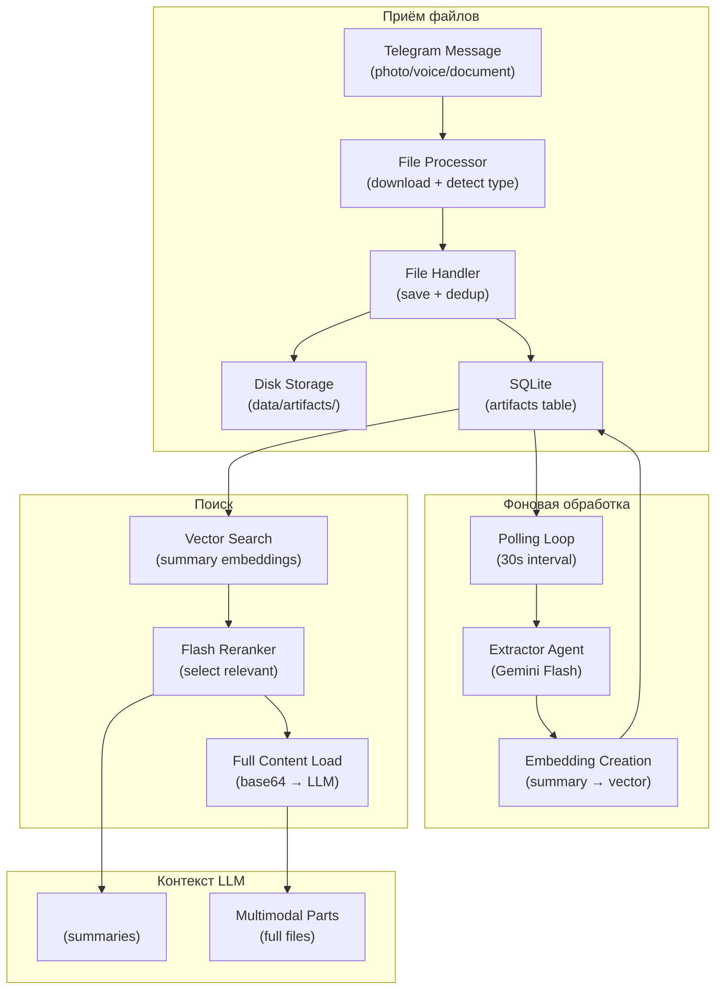
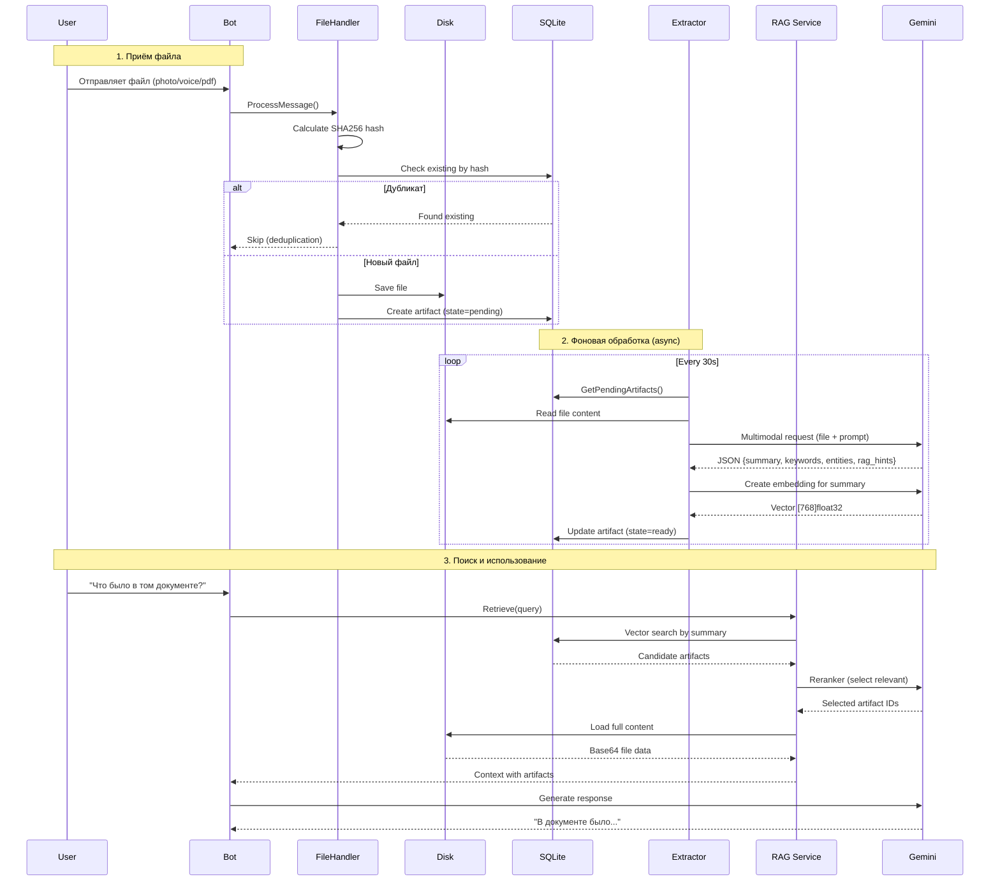

# Artifacts System

Этот документ описывает архитектуру системы артефактов — хранения и семантического поиска по файлам (изображения, аудио, PDF, видео).

## Обзор

Artifacts System (v0.6.0) — компонент Long Context RAG для файлов:
- Сохраняет файлы на диск с дедупликацией по хэшу
- Извлекает метаданные через Extractor agent (Gemini Flash)
- Интегрирует артефакты в RAG pipeline через reranker
- Загружает полное содержимое выбранных файлов в контекст LLM

**Пример использования:**
```
User: [отправляет PDF с документацией]
Bot: [сохраняет, извлекает summary/keywords/entities]

... позже ...

User: "Что было в той документации про API?"
Bot: [находит PDF через vector search, загружает в контекст]
     > 📄 **api-docs.pdf:** Документация описывает REST API...
```

## Архитектура

### Компоненты



### Поток данных



## Модель данных

### Структура Artifact

```go
type Artifact struct {
    ID        int64  `json:"id"`
    UserID    int64  `json:"user_id"`
    MessageID int64  `json:"message_id"`

    // File metadata
    FileType     string `json:"file_type"`     // 'image', 'voice', 'pdf', 'video_note', 'document'
    FilePath     string `json:"file_path"`     // Relative path from storage dir
    FileSize     int64  `json:"file_size"`     // Bytes
    MimeType     string `json:"mime_type"`
    OriginalName string `json:"original_name"` // From Telegram

    // Deduplication
    ContentHash string `json:"content_hash"`  // SHA256 of file content

    // Processing status
    State        string  `json:"state"`         // 'pending', 'processing', 'ready', 'failed'
    ErrorMessage *string `json:"error_message"`
    RetryCount   int     `json:"retry_count"`   // For exponential backoff
    LastFailedAt *time.Time `json:"last_failed_at"`

    // AI-generated metadata
    Summary   *string   `json:"summary"`    // 2-4 sentence description
    Keywords  *string   `json:"keywords"`   // JSON array: ["tag1", "tag2"]
    Entities  *string   `json:"entities"`   // JSON array: ["person", "company"]
    RAGHints  *string   `json:"rag_hints"`  // JSON array: ["what questions?"]
    Embedding []float32 `json:"embedding"`  // Summary embedding for vector search

    CreatedAt   time.Time  `json:"created_at"`
    ProcessedAt *time.Time `json:"processed_at"`
}
```

### Типы файлов

| FileType | Источник | MIME types | Обработка |
|----------|----------|------------|-----------|
| `image` | Photo, Document | `image/*` | FilePart (data URL) |
| `voice` | Voice | `audio/ogg` | FilePart |
| `audio` | Audio | `audio/*` | FilePart |
| `pdf` | Document | `application/pdf` | FilePart |
| `video_note` | VideoNote | `video/mp4` | FilePart |
| `video` | Video | `video/*` | FilePart |
| `document` | Document | `text/*` | TextPart + Compact marker* |

\* **Compact History Markers (v0.6.0):** Для текстовых документов в `history.content` сохраняется компактный маркер вместо полного содержимого, чтобы избежать раздувания topics при архивации:

```
# В history.content (сохраняется в БД):
[User ...]
📄 artifacts-pre-release.md (artifact:5)

# В LLMParts (для текущего LLM-вызова):
[TextPart: "artifacts-pre-release.md:\n\n# Artifacts System: Pre-release Tasks\n..."]
```

Это обеспечивает:
- **Компактные topics** — при архивации не bloating с summary
- **Полный контент для LLM** — через `LLMParts` в текущем запросе
- **RAG retrieval** — enricher/reranker видят содержимое через `rawQuery`

### Состояния артефакта

```
pending ──────► processing ──────► ready
    │               │
    │               ▼
    │           failed
    │               │
    └───────────────┘
       (retry with backoff)
```

| State | Описание |
|-------|----------|
| `pending` | Ожидает обработки |
| `processing` | Extractor работает |
| `ready` | Метаданные извлечены, доступен для поиска |
| `failed` | Ошибка (будет retry с backoff) |

## Extractor Agent

### Назначение

Extractor — single-shot LLM agent для извлечения метаданных из файлов. Не извлекает полный текст, только структурированные метаданные для семантического поиска.

**Расположение:** `internal/agent/extractor/extractor.go`

### Входные данные

| Параметр | Источник | Описание |
|----------|----------|----------|
| `artifact` | Request.Params | Структура Artifact для обработки |
| `Profile` | SharedContext | Профиль пользователя (для персонализации) |
| `InnerCircle` | SharedContext | Близкие люди (для распознавания имён) |
| `RecentTopics` | SharedContext | Недавние темы (для контекста) |

### Выходные данные

```json
{
  "summary": "Подробное описание файла (2-4 предложения). Включает основные темы, ключевую информацию и назначение документа.",
  "keywords": ["api", "rest", "authentication", "json"],
  "entities": ["OpenAPI", "OAuth2", "JWT", "Stripe"],
  "rag_hints": [
    "Как авторизоваться через API?",
    "Какие эндпоинты доступны?",
    "Как обрабатывать ошибки?"
  ]
}
```

### Модель и настройки (v0.6.0)

```yaml
# Storage settings
artifacts:
  enabled: true
  storage_path: "data/artifacts"
  allowed_types: ["image", "voice", "pdf", "video_note", "video", "document"]
  min_voice_duration_seconds: 300

# Extractor agent (processing settings)
agents:
  extractor:
    name: "Extractor"
    model: "google/gemini-3-flash-preview"
    max_file_size_mb: 20
    timeout: "2m"
    max_retries: 3
    polling_interval: "30s"
    max_concurrent: 3
    recovery_threshold: "10m"

# Reranker (RAG settings)
agents:
  reranker:
    artifacts:
      candidates_limit: 20
      max: 10
      max_context_bytes: 52428800  # 50MB
```

**Почему Flash:**
- Метаданные — простая задача, не требует Opus/Sonnet
- ~500 output tokens на файл
- Стоимость ~$0.001 на артефакт

### Персонализация

Extractor получает контекст пользователя для:
1. **Распознавания людей** — если в документе упомянут "Петров", а в InnerCircle есть Петров из Work_Inner — entities будут точнее
2. **Релевантных rag_hints** — вопросы генерируются с учётом интересов пользователя
3. **Контекстных keywords** — "рабочий документ" → теги из области работы пользователя

## RAG Integration

### Vector Search

Поиск артефактов по cosine similarity между:
- Query embedding (запрос пользователя)
- Summary embedding (summary артефакта)

```go
type ArtifactVectorItem struct {
    ArtifactID int64
    UserID     int64
    Embedding  []float32
}

// Map: UserID -> []ArtifactVectorItem
artifactVectors map[int64][]ArtifactVectorItem
```

### Reranker Integration

Артефакты передаются в reranker как кандидаты наравне с топиками и людьми (v0.6.0 with scores):

```
[Artifact:123] (0.68) pdf: "api-docs.pdf" | api, rest | Entities: OAuth2, JWT | Summary...
[Artifact:456] (0.72) image: "diagram.png" | architecture, flow | Entities: Service A | Summary...
```

Reranker выбирает релевантные артефакты и возвращает их ID.

### Context Assembly

После reranker артефакты попадают в контекст двумя способами:

**1. Summary context (`<artifact_context>`):**
```xml
<artifact_context query="API документация">
  <artifact id="123" type="pdf (api-docs.pdf)" relevance="0.87">
    <summary>Документация REST API с описанием авторизации...</summary>
    <keywords>api, rest, authentication, json</keywords>
  </artifact>
</artifact_context>
```

**2. Full content (multimodal parts):**
```
📄 api-docs.pdf (15 Jan)
[FilePart: data:application/pdf;base64,...]
```

Полное содержимое загружается только для артефактов, выбранных reranker'ом.

## Background Processing

### Polling Loop

```go
func (s *Service) artifactExtractionLoop(ctx context.Context) {
    ticker := time.NewTicker(s.cfg.Agents.Extractor.GetPollingInterval()) // 30s default
    for {
        select {
        case <-ctx.Done():
            return
        case <-ticker.C:
            s.processArtifactExtraction(ctx)
        }
    }
}
```

### Rate Limiting

```yaml
agents:
  extractor:
    max_concurrent: 3         # Параллельных обработок
    polling_interval: "30s"   # Интервал проверки
    timeout: "2m"             # Таймаут на один файл
```

### Retry с Exponential Backoff

| Retry # | Backoff |
|---------|---------|
| 0 | 1 минута |
| 1 | 5 минут |
| 2+ | 30 минут |

```sql
-- GetPendingArtifacts включает retriable failed
WHERE state = 'pending'
   OR (state = 'failed'
       AND retry_count < 3
       AND (retry_count = 0 AND last_failed_at < now - 1min)
       OR (retry_count = 1 AND last_failed_at < now - 5min)
       OR (retry_count >= 2 AND last_failed_at < now - 30min))
```

### Recovery on Startup

При старте сервиса восстанавливаются "зависшие" артефакты:

```go
// Артефакты в 'processing' дольше threshold → reset to 'pending'
store.RecoverArtifactStates(cfg.Agents.Extractor.GetRecoveryThreshold()) // 10m default
```

## Graceful Shutdown

### Механизм

```go
type Service struct {
    shuttingDown      atomic.Bool  // Флаг остановки
    inFlightArtifacts sync.Map     // artifactID -> startTime
}

func (s *Service) Stop() {
    s.shuttingDown.Store(true)  // Не принимаем новые задачи

    // Логируем in-flight артефакты
    s.inFlightArtifacts.Range(func(key, value interface{}) bool {
        log.Info("waiting for artifact", "id", key, "running_for", time.Since(value))
        return true
    })

    s.wg.Wait()  // Ждём завершения всех горутин
}
```

### Таймауты

```yaml
agents:
  extractor:
    timeout: "2m"  # Макс время на один артефакт
```

Каждая горутина обработки использует отдельный контекст с таймаутом, чтобы shutdown не прерывал LLM-вызовы посреди работы.

## Context Limits

### Защита от переполнения (v0.6.0)

```yaml
agents:
  reranker:
    artifacts:
      max: 10                  # Макс артефактов в контексте
      max_context_bytes: 52428800  # 50MB cumulative limit
```

```go
func (l *Laplace) loadArtifactFullContent(...) {
    for _, artifactID := range artifactIDs {
        // Проверка лимитов ПЕРЕД чтением файла
        if loadedCount >= maxArtifacts {
            break
        }
        if totalBytes + artifact.FileSize > maxBytes {
            break
        }

        fileData, _ := os.ReadFile(fullPath)
        totalBytes += len(fileData)
        loadedCount++
        // ... create multimodal part
    }
}
```

## Конфигурация

### Полный список параметров (v0.6.0)

```yaml
# Storage settings
artifacts:
  enabled: true
  storage_path: "data/artifacts"
  allowed_types: ["image", "voice", "pdf", "video_note", "video", "document"]
  min_voice_duration_seconds: 300  # 5 мин; 0 = все, -1 = отключить

# Extractor agent (processing settings)
agents:
  extractor:
    name: "Extractor"
    model: "google/gemini-3-flash-preview"
    max_file_size_mb: 20        # Макс размер файла для обработки
    timeout: "2m"               # Макс время на один артефакт
    max_retries: 3              # Попыток retry
    polling_interval: "30s"     # Интервал проверки pending
    max_concurrent: 3           # Параллельных обработок
    recovery_threshold: "10m"   # Recovery zombie states

# Reranker (RAG settings)
agents:
  reranker:
    artifacts:
      candidates_limit: 20      # Макс кандидатов из vector search
      max: 10                  # Макс в final selection
      max_context_bytes: 52428800  # 50MB cumulative limit
```

### Environment Variables (v0.6.0)

| Variable | Description |
|----------|-------------|
| `LAPLACED_ARTIFACTS_ENABLED` | Enable/disable system |
| `LAPLACED_ARTIFACTS_STORAGE_PATH` | Path for file storage |
| `LAPLACED_EXTRACTOR_MAX_FILE_SIZE_MB` | Max file size |
| `LAPLACED_EXTRACTOR_POLLING_INTERVAL` | Background polling interval |
| `LAPLACED_EXTRACTOR_TIMEOUT` | Single file timeout |
| `LAPLACED_EXTRACTOR_MAX_RETRIES` | Retry attempts |
| `LAPLACED_EXTRACTOR_MAX_CONCURRENT` | Parallel processing limit |

## User Data Isolation

**Критический инвариант:** Все SQL-запросы включают `WHERE user_id = ?`

```go
// GetArtifact — проверка user_id
func (s *SQLiteStore) GetArtifact(userID, artifactID int64) (*Artifact, error) {
    query := `SELECT ... FROM artifacts WHERE user_id = ? AND id = ?`
    //                                        ^^^^^^^^^^^
}

// GetArtifacts — валидация обязательности user_id
func (s *SQLiteStore) GetArtifacts(filter ArtifactFilter, ...) {
    if filter.UserID == 0 {
        return nil, 0, fmt.Errorf("UserID required for GetArtifacts")
    }
}
```

Vector search также изолирован:
```go
artifactVectors map[int64][]ArtifactVectorItem  // Key = UserID
```

## Deduplication

### По Content Hash

```go
func (fh *FileHandler) SaveFile(...) error {
    // 1. Save file, calculate SHA256
    savedFile, _ := fh.storage.SaveFile(ctx, userID, reader, originalName)

    // 2. Check for existing artifact
    existing, _ := fh.artifactRepo.GetByHash(userID, savedFile.ContentHash)
    if existing != nil {
        log.Info("artifact already exists, reusing", "existing_id", existing.ID)
        return nil  // Skip duplicate
    }

    // 3. Create new artifact
    fh.artifactRepo.AddArtifact(artifact)
}
```

### Database Constraint

```sql
CREATE TABLE artifacts (
    ...
    UNIQUE(user_id, content_hash)
);
```

## LLM Output Format

### artifact_protocol в System Prompt

```xml
<artifact_protocol>
ФАЙЛЫ (<artifact_context>):
- Если в контекст попали файлы из твоей памяти — ОБЯЗАТЕЛЬНО упомяни их в ответе.
- Формат: цитируй в начале ответа как > 📄 **[имя файла]:** [в чём суть / что нашёл]
- При нескольких файлах — перечисли каждый отдельно.
- НЕ пиши "[имя файла]" если это технический ID — используй понятное имя из тега type.
</artifact_protocol>
```

### Пример ответа бота

```
> 📄 **api-docs.pdf:** Документация REST API с описанием эндпоинтов авторизации через OAuth2.

Судя по документации, для авторизации нужно:
1. Получить client_id и client_secret
2. Сделать POST на /oauth/token
...
```

## Метрики

```go
// Prometheus метрики (v0.6.0)
RecordArtifactExtraction(userID int64, duration float64, success bool)
RecordVectorSearch(userID int64, searchType string, duration float64, vectorsScanned int)
RecordRAGCandidates(userID int64, candidateType string, count int)
```

| Metric | Labels | Description |
|--------|--------|-------------|
| `laplaced_artifact_extraction_jobs_total` | `user_id`, `status` | Всего обработок артефактов |
| `laplaced_artifact_extraction_duration_seconds` | `user_id`, `status` | Время обработки артефакта |
| `laplaced_vector_search_duration_seconds` | `user_id`, `type=artifacts` | Время vector search |
| `laplaced_rag_candidates_total` | `user_id`, `type=artifacts` | Количество кандидатов |

## Тестирование

### Unit Tests

```bash
go test ./internal/storage/... -run Artifact
go test ./internal/rag/... -run Artifact
go test ./internal/agent/laplace/... -run Artifact
```

### Manual Testing (testbot)

```bash
# Отправить сообщение с файлом и проверить обработку
go run ./cmd/testbot send "Check this document" --file docs/example.pdf

# Проверить артефакты в БД
go run ./cmd/testbot check-artifacts

# Триггернуть обработку
go run ./cmd/testbot process-artifacts
```

## Ограничения

1. **Нет OCR** — текст из изображений извлекается только если Gemini его "видит"
2. **Нет поиска внутри файла** — только summary-based search
3. **Большие файлы** — ограничены `max_file_size_mb` (20MB default)
4. **Нет GC** — файлы не удаляются автоматически (personal bot scale)
