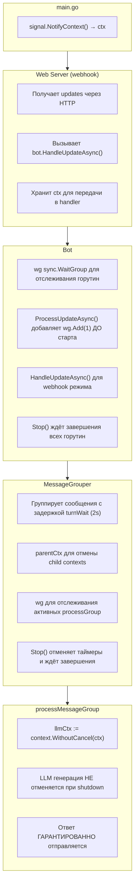
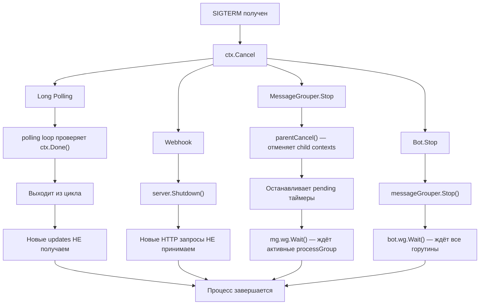
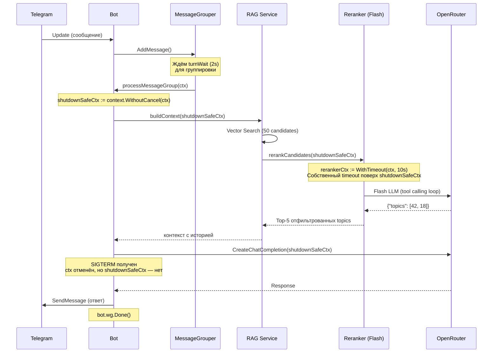

# Graceful Shutdown

Этот документ описывает механизм корректного завершения работы бота и принятые архитектурные решения.

## Обзор

При получении сигнала `SIGTERM` или `SIGINT` бот должен:
1. Прекратить приём новых сообщений
2. Завершить обработку уже принятых сообщений
3. Отправить ответы пользователям
4. Корректно закрыть все соединения

## Архитектура

### Компоненты и их роли



### Поток данных при shutdown



### Жизненный цикл сообщения



## Ключевые решения

### 1. Вся обработка сообщения не отменяется при shutdown

**Проблема:** При отмене контекста HTTP запросы (RAG, LLM, отправка) прерываются, пользователь не получает ответ.

**Решение:** Используем `context.WithoutCancel(ctx)` для всех операций обработки:

```go
// process_group.go
func (b *Bot) processMessageGroup(ctx context.Context, group *MessageGroup) {
    // Создаём non-cancellable контекст в начале обработки
    shutdownSafeCtx := context.WithoutCancel(ctx)

    // Typing action использует этот контекст
    typingCtx, cancelTyping := context.WithCancel(shutdownSafeCtx)
    go b.sendTypingActionLoop(typingCtx, chatID, threadID)

    // RAG retrieval использует этот контекст
    orMessages, ragInfo, err := b.buildContext(shutdownSafeCtx, userID, ...)

    // LLM генерация использует этот контекст
    resp, err := b.orClient.CreateChatCompletion(shutdownSafeCtx, req)

    // Отправка ответа тоже
    b.sendResponses(shutdownSafeCtx, chatID, responses, logger)
}
```

**Обоснование:**
- Пользователь должен получить ответ на уже принятое сообщение
- RAG + LLM генерация может занимать до минуты
- Typing action должен показываться пока идёт обработка
- Новые сообщения после shutdown будут доставлены Telegram после рестарта

### 2. Reranker имеет собственный timeout

**Проблема:** Reranker использует agentic LLM loop с tool calls. Без ограничения времени он может зависнуть (медленный LLM, много итераций).

**Решение:** Reranker создаёт child context с timeout поверх shutdownSafeCtx:

```go
// reranker.go
func (s *Service) rerankCandidates(ctx context.Context, ...) (*RerankerResult, error) {
    timeout, _ := time.ParseDuration(cfg.Timeout) // default: 10s
    ctx, cancel := context.WithTimeout(ctx, timeout)
    defer cancel()

    // Agentic loop с tool calls
    for toolCallCount < cfg.MaxToolCalls {
        resp, err := s.client.CreateChatCompletion(ctx, req)
        if err != nil {
            // Timeout или ошибка → fallback
            return s.fallbackFromState(state, candidates, cfg.MaxTopics), nil
        }
        // ...
    }
}
```

**Поведение при shutdown:**

| Сценарий | Результат |
|----------|-----------|
| Reranker активен, SIGTERM | Продолжает работу (shutdownSafeCtx не отменяется) |
| Reranker timeout (10s) | Fallback на requestedIDs или vector top |
| LLM ошибка | Fallback на requestedIDs или vector top |
| Max tool calls (3) | Fallback на requestedIDs или vector top |

**Обоснование:**
- shutdownSafeCtx защищает от преждевременной отмены при shutdown
- Собственный timeout (10s) гарантирует, что reranker не зависнет
- Fallback стратегия обеспечивает graceful degradation

### 3. WaitGroup.Add() вызывается ДО старта горутины

**Проблема:** Race condition — если `wg.Wait()` вызван до `wg.Add(1)`, произойдёт panic.

**Неправильно:**
```go
go func() {
    wg.Add(1)  // ← Race condition!
    defer wg.Done()
    process()
}()
```

**Правильно:**
```go
wg.Add(1)
go func() {
    defer wg.Done()
    process()
}()
```

### 4. Pending группы обрабатываются при shutdown

**Проблема:** Если пользователь отправил сообщение и сразу произошёл shutdown (в течение turnWait), сообщение может быть потеряно — Telegram считает его доставленным.

**Решение:** При shutdown обрабатываем все pending группы немедленно:

```go
// message_grouper.go - Stop()
for userID, group := range mg.groups {
    if group.Timer.Stop() {
        // Таймер остановлен ДО срабатывания — обрабатываем группу сейчас
        pendingGroups = append(pendingGroups, group)
    }
}

// Запускаем обработку pending групп
for _, group := range pendingGroups {
    go func(g *MessageGroup) {
        defer mg.wg.Done()
        mg.onGroupReady(context.Background(), g)
    }(group)
}

mg.wg.Wait() // Ждём завершения всех обработок
```

### 5. Webhook использует server context, не request context

**Проблема:** `r.Context()` отменяется когда HTTP handler возвращается, но обработка продолжается асинхронно.

**Решение:**
```go
// server.go
type Server struct {
    ctx context.Context  // Сохраняем контекст сервера
}

func (s *Server) Start(ctx context.Context) error {
    s.ctx = ctx  // Используем для webhook handler
}

func (s *Server) webhookHandler(w http.ResponseWriter, r *http.Request) {
    // Используем s.ctx, не r.Context()
    s.bot.HandleUpdateAsync(s.ctx, body, r.RemoteAddr)
}
```

### 6. Typing action использует detached context

**Проблема:** При отмене основного контекста typing action возвращает ошибку "context canceled", которая засоряет логи.

**Решение:**
```go
// bot.go
func (b *Bot) sendAction(ctx context.Context, chatID int64, action string) {
    // Используем отдельный контекст с таймаутом, не привязанный к parent
    actionCtx, cancel := context.WithTimeout(context.Background(), actionTimeout)
    defer cancel()
    b.api.SendChatAction(actionCtx, req)
}
```

### 7. Retry отправки сообщений использует bounded context

**Проблема:** При ошибке отправки сообщения (например, ошибка парсинга MarkdownV2) нужен retry. Если использовать `context.Background()`, retry может зависнуть навсегда.

**Решение:**
```go
// bot.go - sendResponses()
if _, err := b.api.SendMessage(ctx, resp); err != nil {
    // Создаём новый контекст с таймаутом для retry
    // Не используем оригинальный ctx — он может быть уже отменён
    retryCtx, cancel := context.WithTimeout(context.Background(), 30*time.Second)
    defer cancel()

    // Retry с новым контекстом
    b.api.SendMessage(retryCtx, resp)
}
```

### 8. Web server использует cancel() вместо os.Exit()

**Проблема:** Если web server падает (например, порт занят), вызов `os.Exit(1)` убивает процесс без выполнения deferred функций (закрытие БД, остановка RAG).

**Решение:**
```go
// main.go
go func() {
    defer close(srvDone)
    if err := webServer.Start(ctx); err != nil {
        logger.Error("web server failed", "error", err)
        cancel() // Запускает graceful shutdown вместо os.Exit(1)
    }
}()
```

## Что происходит с сообщениями

| Момент отправки | Long Polling | Webhook |
|-----------------|--------------|---------|
| До shutdown | Обрабатывается, ответ отправляется | Обрабатывается, ответ отправляется |
| Во время Reranker (agentic loop) | Reranker завершится или timeout (10s) → fallback | То же самое |
| Во время обработки (RAG + LLM) | Обработка завершится, ответ отправится | Обработка завершится, ответ отправится |
| В turnWait (ожидание группировки) | Группа обработается немедленно | Группа обработается немедленно |
| После shutdown | Придёт после рестарта | Telegram повторит доставку |

## Тестирование

Тесты в `internal/bot/graceful_shutdown_test.go`:

1. **TestProcessMessageGroup_CompletesOnContextCancel** — проверяет, что `SendMessage` вызывается даже после отмены контекста

2. **TestProcessMessageGroup_LLMContextNotCancelled** — проверяет, что контекст для LLM не отменяется (через `context.WithoutCancel`)

## Связанные файлы

- `cmd/bot/main.go` — точка входа, signal handling
- `internal/bot/bot.go` — Bot.Stop(), ProcessUpdateAsync(), HandleUpdateAsync()
- `internal/bot/message_grouper.go` — MessageGrouper.Stop(), управление таймерами
- `internal/bot/process_group.go` — processMessageGroup(), shutdownSafeCtx
- `internal/rag/reranker.go` — rerankCandidates(), собственный timeout
- `internal/web/server.go` — webhook handler, server context
