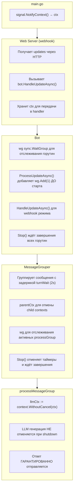
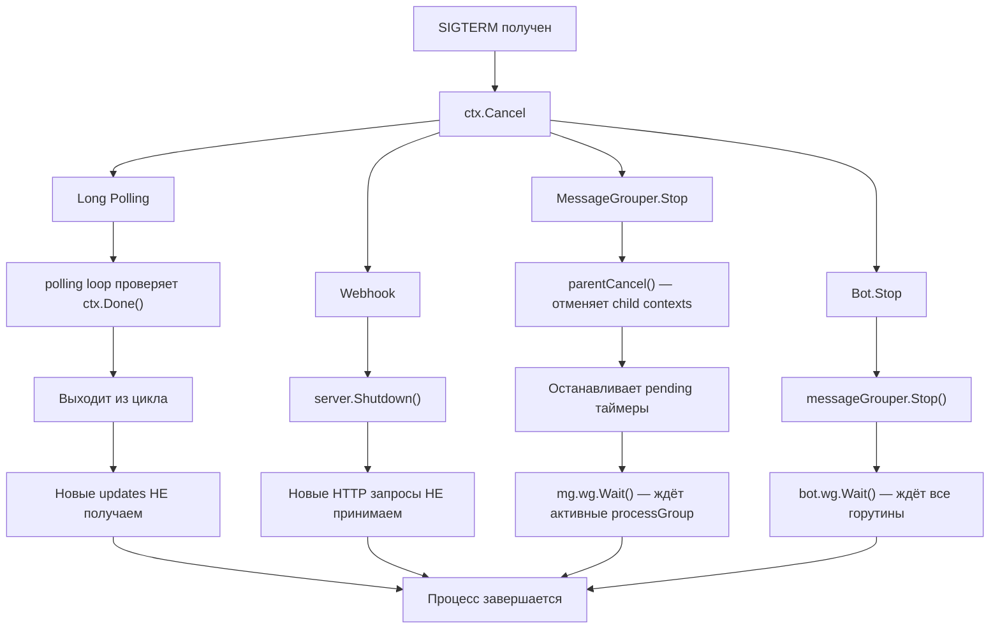
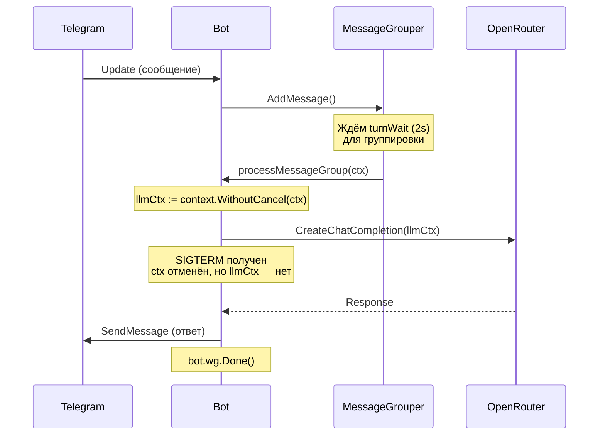

# Graceful Shutdown

Этот документ описывает механизм корректного завершения работы бота и принятые архитектурные решения.

## Обзор

При получении сигнала `SIGTERM` или `SIGINT` бот должен:
1. Прекратить приём новых сообщений
2. Завершить обработку уже принятых сообщений
3. Отправить ответы пользователям
4. Корректно закрыть все соединения

## Архитектура

### Компоненты и их роли



### Поток данных при shutdown



### Жизненный цикл сообщения



## Ключевые решения

### 1. LLM генерация не отменяется при shutdown

**Проблема:** При отмене контекста HTTP запрос к OpenRouter прерывается, пользователь не получает ответ.

**Решение:** Используем `context.WithoutCancel(ctx)` для LLM вызовов:

```go
// process_group.go
llmCtx := context.WithoutCancel(ctx)
resp, err := b.orClient.CreateChatCompletion(llmCtx, req)
```

**Обоснование:**
- Пользователь должен получить ответ на уже принятое сообщение
- LLM генерация может занимать до минуты
- Новые сообщения после shutdown всё равно будут доставлены Telegram после рестарта

### 2. WaitGroup.Add() вызывается ДО старта горутины

**Проблема:** Race condition — если `wg.Wait()` вызван до `wg.Add(1)`, произойдёт panic.

**Неправильно:**
```go
go func() {
    wg.Add(1)  // ← Race condition!
    defer wg.Done()
    process()
}()
```

**Правильно:**
```go
wg.Add(1)
go func() {
    defer wg.Done()
    process()
}()
```

### 3. Timer.Stop() возвращает bool

**Проблема:** При остановке таймера нужно корректно обработать WaitGroup.

```go
if group.Timer.Stop() {
    // Таймер остановлен ДО срабатывания — callback не выполнится
    mg.wg.Done()  // Декрементируем вручную
} else {
    // Таймер уже сработал — callback выполняется или выполнен
    // wg.Done() будет вызван в callback
}
```

### 4. Webhook использует server context, не request context

**Проблема:** `r.Context()` отменяется когда HTTP handler возвращается, но обработка продолжается асинхронно.

**Решение:**
```go
// server.go
type Server struct {
    ctx context.Context  // Сохраняем контекст сервера
}

func (s *Server) Start(ctx context.Context) error {
    s.ctx = ctx  // Используем для webhook handler
}

func (s *Server) webhookHandler(w http.ResponseWriter, r *http.Request) {
    // Используем s.ctx, не r.Context()
    s.bot.HandleUpdateAsync(s.ctx, body, r.RemoteAddr)
}
```

### 5. Typing action использует detached context

**Проблема:** При отмене основного контекста typing action возвращает ошибку "context canceled", которая засоряет логи.

**Решение:**
```go
// bot.go
func (b *Bot) sendAction(ctx context.Context, chatID int64, action string) {
    // Используем отдельный контекст с таймаутом, не привязанный к parent
    actionCtx, cancel := context.WithTimeout(context.Background(), actionTimeout)
    defer cancel()
    b.api.SendChatAction(actionCtx, req)
}
```

## Что происходит с сообщениями

| Момент отправки | Long Polling | Webhook |
|-----------------|--------------|---------|
| До shutdown | Обрабатывается, ответ отправляется | Обрабатывается, ответ отправляется |
| Во время LLM генерации | LLM завершится, ответ отправится | LLM завершится, ответ отправится |
| В turnWait (ожидание группировки) | Таймер отменится, сообщение потеряется* | Таймер отменится, сообщение потеряется* |
| После shutdown | Придёт после рестарта | Telegram повторит доставку |

*Сообщения в turnWait теряются локально, но Telegram сохраняет offset — после рестарта они придут снова.

## Тестирование

Тесты в `internal/bot/graceful_shutdown_test.go`:

1. **TestProcessMessageGroup_CompletesOnContextCancel** — проверяет, что `SendMessage` вызывается даже после отмены контекста

2. **TestProcessMessageGroup_LLMContextNotCancelled** — проверяет, что контекст для LLM не отменяется (через `context.WithoutCancel`)

## Связанные файлы

- `cmd/bot/main.go` — точка входа, signal handling
- `internal/bot/bot.go` — Bot.Stop(), ProcessUpdateAsync(), HandleUpdateAsync()
- `internal/bot/message_grouper.go` — MessageGrouper.Stop(), управление таймерами
- `internal/bot/process_group.go` — processMessageGroup(), llmCtx
- `internal/web/server.go` — webhook handler, server context
