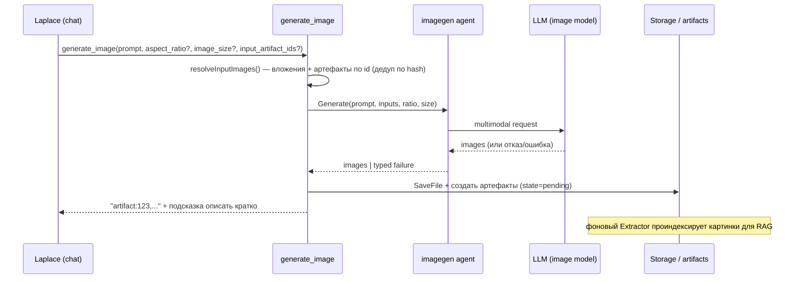

# Image Generation (генерация и редактирование изображений)

Этот документ описывает инструмент `generate_image` (v0.8.0) — генерацию,
редактирование и комбинирование изображений по запросу пользователя.

## Обзор

`generate_image` — это tool главного чат-агента (Laplace). Через него бот умеет:

- **text-to-image** — нарисовать картинку по описанию («нарисуй кота-самурая»);
- **редактирование** — изменить фото, приложенное в том же сообщении («сделай сепию», «замени фон»);
- **комбинирование** — собрать одно изображение из нескольких вложений;
- **переработку из памяти** — взять картинку из прошлого разговора (артефакт,
  попавший в контекст через reranker) и смешать её с новым вложением.

Сгенерированные изображения становятся обычными артефактами и индексируются для
RAG: спустя недели вопрос «что ты мне рисовал про X?» вернёт их через векторный
поиск.

## Поток



Несколько `generate_image` в одном ходе выполняются **параллельно** (semaphore,
`max_concurrent`, по умолчанию 4); остальные инструменты — последовательно.

## JSON-схема из конфига

Схема tool'а строится динамически из конфига
(`internal/agent/laplace/tools.go`): enum'ы `aspect_ratio` и `image_size` берутся
прямо из `supported_aspect_ratios` / `supported_image_sizes`. Поэтому модель видит
только те значения, которые реально принимает upstream-модель — при смене модели
нужно обновить эти списки, иначе будут runtime-400.

Параметры: `prompt` (обязателен), `aspect_ratio`, `image_size`,
`input_artifact_ids` (массив id артефактов из памяти).

**Дефолты** (`internal/agent/imagegen/imagegen.go`): если ratio пуст и входных
картинок нет → `default_aspect_ratio`; если есть входные картинки → ratio не
навязывается (сохраняется исходный); `image_size` пуст → `default_image_size`.

## Доставка результата

`internal/bot/transport_telegram.go`:

- Картинки **меньше** `document_threshold_bytes` (по умолчанию 2 MB) уходят как
  Photo; **больше или равно** — как Document (Telegram не пережимает Document до
  ~1280px, в отличие от Photo).
- Один файл — одиночная отправка; 2–10 — сгруппированный альбом.
- Подпись рендерится Markdown → HTML так же, как текстовые ответы; переполнение
  лимита подписи уходит отдельным сообщением.

## Обработка ошибок: пять режимов

Раньше бот при любой неудаче выдавал одну из трёх причин «наугад» (почти всегда
«safety filter»). Теперь классификатор (`internal/agent/imagegen/classify.go`)
различает по **форме** ответа (Images / Content / Provider), а не по
`finish_reason`:

| Режим | Сигнал | Что говорит пользователю |
|-------|--------|--------------------------|
| `timeout` | `context.DeadlineExceeded` | сервер не успел, повторить позже |
| `provider_error` | прочая ошибка вызова | ошибка API, временная |
| `text_refusal` | есть текст, нет картинок | дословная цитата отказа модели (переведённая) |
| `silent_block_oai` | OpenAI, ни картинок, ни текста | вероятно политика контента, перефразируй |
| `unknown_no_images` | нет картинок и текста (не OpenAI) | причина неизвестна |

Tool-слой (`internal/bot/tools/image.go`) распознаёт типизированный
`ImageGenFailure` и формирует результат, который **останавливает** дальнейшие
попытки в этом ходе (чтобы LLM не сжёг 5–10 вызовов на одну и ту же ошибку), с
объяснением по конкретному режиму. Исход фиксируется на спане
`imagegen.outcome` (см. [observability.md](./observability.md)).

## Артефакты и RAG

Каждое выходное изображение сохраняется в блоб-хранилище и заводит артефакт со
`state=pending` и `UserContext = prompt`. Фоновый Extractor извлекает метаданные и
эмбеддинг, после чего картинка участвует в RAG наравне с остальными артефактами
(см. [artifacts-system.md](./artifacts-system.md)).

## Конфигурация

```yaml
agents:
  image_generator:
    model: "openai/gpt-5.4-image-2"   # "" → инструмент generate_image выключен
    timeout: "720s"                   # gpt-5.4-image-2 медленный; nano banana — 90s
    default_aspect_ratio: "9:16"
    default_image_size: "1K"
    supported_image_sizes: ["1K", "2K"]
    supported_aspect_ratios: ["1:1", "2:3", "3:2", "3:4", "4:3", "4:5", "5:4", "9:16", "16:9", "21:9"]
    max_input_images: 4
    max_output_images: 4
    max_input_image_bytes: 20971520    # 20MB
    document_threshold_bytes: 2097152  # 2MB
    max_concurrent: 4
```

`default.yaml` содержит две выверенные конфигурации (curl-verified):
`openai/gpt-5.4-image-2` (выше качество, медленнее, дороже, потолок 2K) и
`google/gemini-3.1-flash-image-preview` («nano banana» — быстрее, дешевле,
поддерживает 4K и экстремальные соотношения сторон 1:4 / 4:1 / 1:8 / 8:1).
Переключение модели = замена `model` + `timeout` + двух списков.

## Связанные документы

- [artifacts-system.md](./artifacts-system.md) — как картинки попадают в память
- [flash-reranker.md](./flash-reranker.md) — как старые картинки возвращаются в контекст
- [message-processing-flow.md](./message-processing-flow.md) — tool loop
