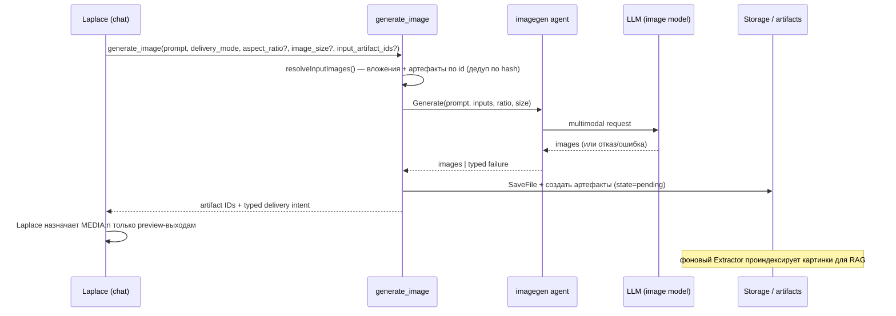

# Image Generation (генерация и редактирование изображений)

Этот документ описывает инструмент `generate_image` (v0.8.0) — генерацию,
редактирование и комбинирование изображений по запросу пользователя.

## Обзор

`generate_image` — это tool главного чат-агента (Laplace). Через него бот умеет:

- **text-to-image** — нарисовать картинку по описанию («нарисуй кота-самурая»);
- **редактирование** — изменить фото, приложенное в том же сообщении («сделай сепию», «замени фон»);
- **комбинирование** — собрать одно изображение из нескольких вложений;
- **переработку из памяти** — взять картинку из прошлого разговора (артефакт,
  попавший в контекст через reranker) и смешать её с новым вложением.

Сгенерированные изображения становятся обычными артефактами и индексируются для
RAG: спустя недели вопрос «что ты мне рисовал про X?» вернёт их через векторный
поиск.

## Поток


```mermaid
sequenceDiagram
    participant LLM as Laplace (chat)
    participant Tool as generate_image
    participant IG as imagegen agent
    participant API as LLM (image model)
    participant ST as Storage / artifacts

    LLM->>Tool: generate_image(prompt, delivery_mode, aspect_ratio?, image_size?, input_artifact_ids?)
    Tool->>Tool: resolveInputImages() — вложения + артефакты по id (дедуп по hash)
    Tool->>IG: Generate(prompt, inputs, ratio, size)
    IG->>API: multimodal request
    API-->>IG: images (или отказ/ошибка)
    IG-->>Tool: images | typed failure
    Tool->>ST: SaveFile + создать артефакты (state=pending)
    Tool-->>LLM: artifact IDs + typed delivery intent
    LLM->>LLM: Laplace назначает MEDIA:n только preview-выходам
    Note over ST: фоновый Extractor проиндексирует картинки для RAG
```

Несколько `generate_image` в одном ходе выполняются **параллельно** (semaphore,
`max_concurrent`, по умолчанию 4); остальные инструменты — последовательно.
Номера `MEDIA:n` присваиваются только выходам с `preview` после join: итерация
tool-loop → индекс `tool_calls` → порядок outputs провайдера. Время завершения
параллельных вызовов на нумерацию не влияет. Ошибка и `original` без preview
номер не занимают.

## JSON-схема из конфига

Схема tool'а строится динамически из конфига
(`internal/agent/laplace/tools.go`): enum'ы `aspect_ratio` и `image_size` берутся
прямо из `supported_aspect_ratios` / `supported_image_sizes`. Поэтому модель видит
только те значения, которые реально принимает upstream-модель — при смене модели
нужно обновить эти списки, иначе будут runtime-400.

Параметры: `prompt` и `delivery_mode` (обязательны), `aspect_ratio`, `image_size`,
`input_artifact_ids` (массив доверенных id из истории/памяти либо из успешной
предыдущей tool-loop итерации; вложения текущего сообщения передаются
автоматически). `delivery_mode` принимает
`preview`, `original` или `preview_and_original`. Runtime сохраняет
backward-compatible default `preview` для старых трасс, хотя актуальная схема
требует поле явно.

**Дефолты** (`internal/agent/imagegen/imagegen.go`): если ratio пуст и входных
картинок нет → `default_aspect_ratio`; если есть входные картинки → ratio не
навязывается (сохраняется исходный); `image_size` пуст → `default_image_size`.

## Доставка результата: private V1

Явная доставка артефактов включена только для eligible private Telegram
rich-send turn. Группы, business messages, direct-message topics и off/shadow
не получают `send_artifacts` и не входят в этот V1-контракт.

Для нового изображения способ доставки выбирается семантическим intent в том
же вызове `generate_image`:

| `delivery_mode` | Telegram presentation |
|---|---|
| `preview` | Photo внутри rich-компоновки; это default |
| `original` | byte-exact Document вместо Photo |
| `preview_and_original` | Photo в rich-компоновке и затем byte-exact Document |

Запрос `2K` или `4K` меняет только разрешение генерации. Он **не** означает
`original`, а размер файла больше прежнего `document_threshold_bytes` больше не
создаёт автоматический Document sidecar. `original` полностью заменяет preview;
`preview_and_original` выбирается только при явной просьбе пользователя
отправить оба варианта. «Красивый/богато оформленный пост» без отдельной просьбы
об исходниках остаётся `preview`.

Только generated preview участвуют в standalone-компоновке
`###MEDIA:n[,n...]###`: один номер даёт ``, 2–4 — collage, 5–10 —
slideshow. Если директив нет, preview gallery ставится сверху. Дубль, пропуск,
недоступный номер или неверная грамматика атомарно отменяют authored layout и
возвращают автоматический порядок. `original` номера не получает. Если
запрошенный preview не проходит Telegram Photo envelope, planner до первого
network call детерминированно понижает его до одного Document.

### Повторная отправка сохранённых артефактов

Отдельный declarative tool `send_artifacts` ставит в план уже существующие
user-owned артефакты из доверенного inventory текущего хода. Он не вызывает
Telegram напрямую и принимает не более 10 элементов в точном порядке:

- `auto` — Photo для совместимой картинки, иначе Document;
- `preview` — Photo; несовместимая картинка до сети понижается до Document;
- `original` — byte-exact Document;
- `preview_and_original` — Photo и Document;
- неизобразительные артефакты (PDF и другие файлы) поддерживают только
  `auto`/`original` и всегда уходят как Document.

Картинки текущего сообщения передаются в `generate_image` автоматически; их
inventory ID нужен только для `send_artifacts`. Для reference/edit картинки из
истории модель использует точный `input_artifact_ids`. Свежесгенерированный ID
может стать input для следующей tool-loop итерации (например, для правки), но
его нельзя повторно выбирать через `send_artifacts`: presentation уже
зафиксирован в `generate_image.delivery_mode`.

Generated preview сначала формируют и завершают rich-пост. Явно запрошенные
originals и все выбранные stored artifacts (включая их Photo preview)
отправляются после него в стабильном порядке; Telegram Rich Messages не имеют
Document block, поэтому originals являются отдельными persistent Document
operations. Один файл отправляется отдельно, совместимые последовательности до
10 элементов могут стать однородным media group.

Весь logical reply заранее превращается в immutable plan, а каждая операция
равна одному Bot API request. До сети создаётся один durable content-free
delivery ledger. После подтверждения всех операций одна транзакция связывает
все transport message ID, assistant history и ordered M:N
`history_artifact_refs`. Новые generated artifacts получают creator history;
повторная отправка stored artifact добавляет reference и не меняет его
изначальную provenance/`artifacts.message_id`. Reaction на любую подтверждённую
часть разрешается к тому же logical reply. `MEDIA`/`SPLIT` и model-authored
internal references не попадают в user-visible wire output или assistant
history; приложение добавляет в history только собственные канонические
`(artifact:N)` markers для будущего доверенного выбора.

Rollout и stop-сигналы описаны в
[telegram-rich-messages.md](../telegram-rich-messages.md).

## Обработка ошибок: пять режимов

Раньше бот при любой неудаче выдавал одну из трёх причин «наугад» (почти всегда
«safety filter»). Теперь классификатор (`internal/agent/imagegen/classify.go`)
различает по **форме** ответа (Images / Content / Provider), а не по
`finish_reason`:

| Режим | Сигнал | Что говорит пользователю |
|-------|--------|--------------------------|
| `timeout` | `context.DeadlineExceeded` | сервер не успел, повторить позже |
| `provider_error` | прочая ошибка вызова | ошибка API, временная |
| `text_refusal` | есть текст, нет картинок | дословная цитата отказа модели (переведённая) |
| `silent_block_oai` | OpenAI, ни картинок, ни текста | вероятно политика контента, перефразируй |
| `unknown_no_images` | нет картинок и текста (не OpenAI) | причина неизвестна |

Tool-слой (`internal/bot/tools/image.go`) распознаёт типизированный
`ImageGenFailure` и формирует результат, который **останавливает** дальнейшие
попытки в этом ходе (чтобы LLM не сжёг 5–10 вызовов на одну и ту же ошибку), с
объяснением по конкретному режиму. Исход фиксируется на спане
`imagegen.outcome` (см. [observability.md](./observability.md)).

## Артефакты и RAG

Каждое выходное изображение сохраняется в блоб-хранилище и заводит артефакт со
`state=pending` и `UserContext = prompt`. Фоновый Extractor извлекает метаданные и
эмбеддинг, после чего картинка участвует в RAG наравне с остальными артефактами
(см. [artifacts-system.md](./artifacts-system.md)).

## Конфигурация

```yaml
agents:
  image_generator:
    model: "openai/gpt-5.4-image-2"   # "" → инструмент generate_image выключен
    timeout: "720s"                   # gpt-5.4-image-2 медленный; nano banana — 90s
    default_aspect_ratio: "9:16"
    default_image_size: "1K"
    supported_image_sizes: ["1K", "2K"]
    supported_aspect_ratios: ["1:1", "2:3", "3:2", "3:4", "4:3", "4:5", "5:4", "9:16", "16:9", "21:9"]
    max_input_images: 4
    max_output_images: 4
    max_input_image_bytes: 20971520    # 20MB
    document_threshold_bytes: 2097152  # legacy off/shadow only; private V1 игнорирует порог
    max_concurrent: 4
```

`default.yaml` содержит две выверенные конфигурации (curl-verified):
`openai/gpt-5.4-image-2` (выше качество, медленнее, дороже, потолок 2K) и
`google/gemini-3.1-flash-image-preview` («nano banana» — быстрее, дешевле,
поддерживает 4K и экстремальные соотношения сторон 1:4 / 4:1 / 1:8 / 8:1).
Переключение модели = замена `model` + `timeout` + двух списков.

## Связанные документы

- [artifacts-system.md](./artifacts-system.md) — как картинки попадают в память
- [flash-reranker.md](./flash-reranker.md) — как старые картинки возвращаются в контекст
- [message-processing-flow.md](./message-processing-flow.md) — tool loop
