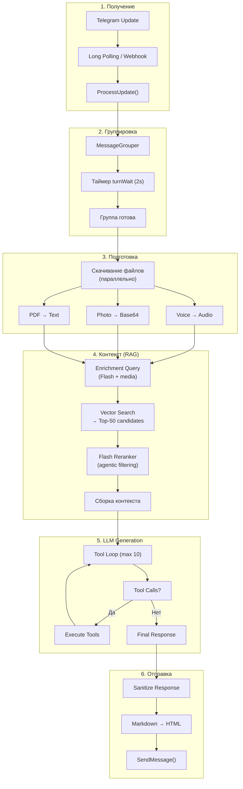
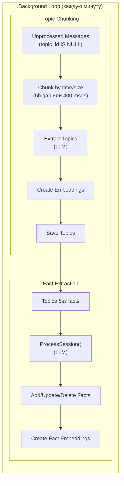
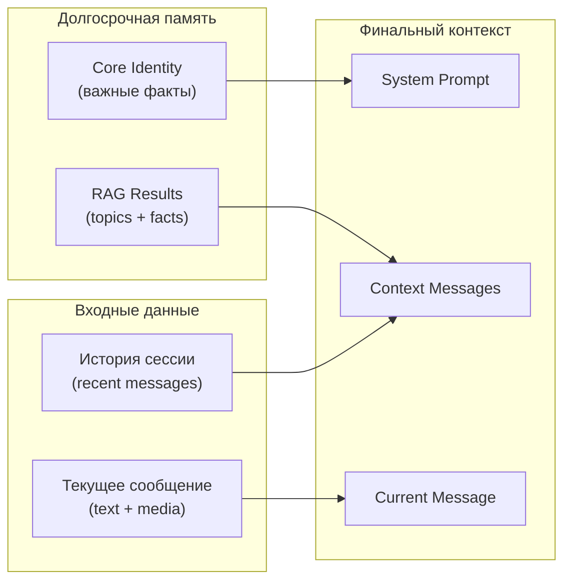
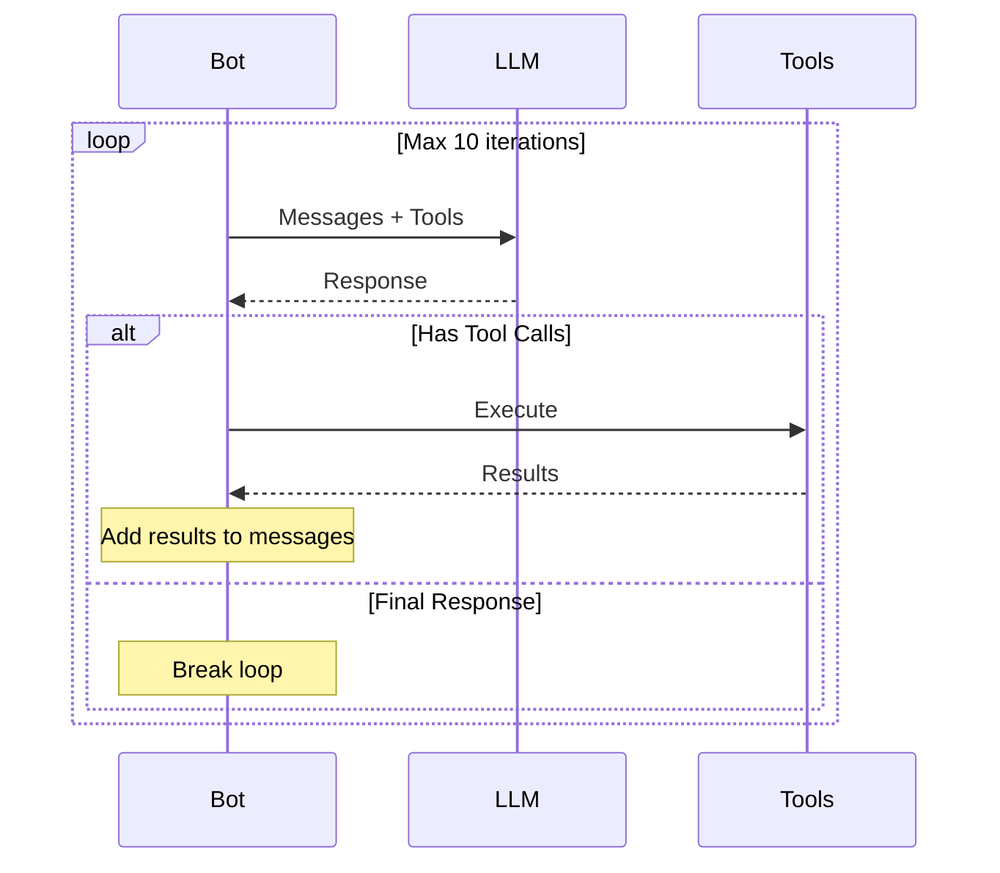

# Message Processing Flow

Этот документ описывает полный путь сообщения от получения до ответа и асинхронной обработки памяти.

## Обзор

При получении сообщения бот:
1. Группирует быстрые сообщения в пакет
2. Скачивает файлы (голос, фото, PDF)
3. Собирает контекст: системный промпт + факты + RAG + история
4. Генерирует ответ через LLM (с возможными tool calls)
5. Отправляет ответ в Telegram
6. Асинхронно извлекает топики и факты для долгосрочной памяти

## Архитектура

### Синхронный путь (пользователь ждёт)



### Асинхронный путь (фоновая обработка)



### Слои контекста



## Детали этапов

### 1. Получение сообщения

| Режим | Источник | Обработка |
|-------|----------|-----------|
| Long Polling | `getUpdates()` loop | Синхронный вызов `ProcessUpdate()` |
| Webhook | HTTP POST `/webhook` | Асинхронный `HandleUpdateAsync()` |

**Ключевые проверки:**
- Авторизация: `isAllowed(userID)`
- Upsert пользователя в БД (для `laplaced_user_info` метрики)

### 2. Группировка сообщений

**Проблема:** Пользователь часто отправляет несколько сообщений подряд. Нужно дождаться паузы.

**Решение:** `MessageGrouper` с таймером `turnWait` (по умолчанию 2 секунды):

```
Сообщение 1 → [таймер 2s] ← отменяется
Сообщение 2 → [таймер 2s] ← отменяется
Сообщение 3 → [таймер 2s] → ✓ Обработка группы
```

### 3. Скачивание файлов

Файлы скачиваются **параллельно** через `errgroup`:

| Тип | Обработка | Формат для LLM |
|-----|-----------|----------------|
| Voice | Скачивание OGG | `AudioPart` (base64) |
| Photo | Скачивание JPEG | `ImagePart` (data URL) |
| PDF/Document | Скачивание | Gemini PDF parser plugin |

**Retry:** Exponential backoff (500ms, 1s, 2s) при ошибках Telegram API.

### 4. Сборка контекста (RAG)

#### Layer 0: Session History
- Последние сообщения с `topic_id IS NULL`
- Лимит: `RAG.MaxContextMessages`

#### Layer 1: Core Identity Facts
- Факты типа `identity` или `importance ≥ 90`
- Всегда включаются в system prompt
- Формируют "личность" бота для данного пользователя

#### Layer 2: RAG Retrieval
1. **Query Enrichment** (опционально)
   - Flash LLM переписывает запрос для лучшего поиска
   - Использует последние 5 сообщений для контекста
   - **Multimodal (v0.4.5):** медиа из сообщения (images, audio) передаётся в enricher

2. **Vector Search**
   - Создаём embedding запроса
   - Cosine similarity по topics и facts
   - Top-50 кандидатов для reranker

3. **Flash Reranker** (v0.4.1+)
   - Agentic фильтрация: Flash видит 50 summaries (~3K токенов)
   - Tool call `get_topics_content([ids])` для загрузки содержимого
   - Финальный выбор: до 15 топиков с reason и excerpt
   - **Multimodal (v0.4.5):** медиа передаётся в reranker
   - Fallback на vector top-5 при timeout/error

4. **Context Assembly**
   - Topics → загружаем связанные сообщения (или excerpt для больших)
   - Facts → добавляем релевантные факты

### 5. LLM Generation (Tool Loop)



**Доступные инструменты:**

| Tool | Назначение |
|------|------------|
| `search_history` | RAG поиск по истории (без enrichment) |
| `manage_memory` | Добавление/обновление/удаление фактов |
| Custom (model-based) | Вызов другой LLM для специфичных задач |

### 6. Отправка ответа

1. **Sanitization**
   - Удаление артефактов (`</tool_code>`, `</s>`)
   - Детекция runaway JSON (3+ consecutive blocks)
   - Метрика: `AnomalySanitized`

2. **Конвертация**
   - Markdown → HTML (Telegram формат)
   - Разбивка на чанки (лимит 4096 UTF-16 символов)
   - Fallback на plain text при ошибках

3. **Отправка**
   - Reply на оригинальное сообщение
   - Сохранение в историю

### 7. Асинхронная обработка

#### Topic Chunking (каждую минуту)

**Триггеры для создания топика:**
- Пауза ≥ `ChunkInterval` (5 часов по умолчанию)
- Накопилось ≥ `MaxChunkSize` сообщений (400)

**Процесс:**
1. LLM извлекает топики (summary + message ranges)
2. Валидация покрытия (все сообщения должны быть в каком-то топике)
3. Создание embeddings для каждого топика
4. Сохранение + обновление `topic_id` у сообщений

#### Fact Extraction (после создания топика)

1. Загрузка сообщений топика
2. LLM извлекает факты (add/update/delete)
3. Создание embeddings для новых/обновлённых фактов
4. Применение изменений к БД

## Метрики

### Per-message breakdown (v0.3.8+)

| Компонент | Метрика | Описание |
|-----------|---------|----------|
| File Download | `file_download_duration_seconds` | Суммарное время скачивания файлов |
| RAG | `rag_latency_seconds{source="auto"}` | Сборка контекста (без tool calls) |
| LLM Total | `message_llm_duration_seconds` | Сумма всех LLM вызовов |
| Tool Execution | `message_tool_duration_seconds` | Сумма выполнения всех tools |
| Telegram Send | `message_telegram_duration_seconds` | Сумма отправки сообщений |

### Аномалии

| Тип | Описание |
|-----|----------|
| `empty_response` | LLM вернул пустой ответ (0 токенов) |
| `sanitized` | Ответ содержал артефакты галлюцинации |
| `retry_success` | Retry после пустого ответа успешен |
| `retry_failed` | Все retry исчерпаны, fallback ответ |

## Ключевые паттерны

### Dependency Injection

Все сервисы получают зависимости через конструкторы:

```go
func NewBot(
    api TelegramAPI,
    orClient OpenRouterClient,
    messageRepo MessageRepository,
    ragService RAGService,
    // ...
) *Bot
```

Никаких глобальных переменных.

### Context Propagation

`context.Context` передаётся во все I/O операции:

```go
func (b *Bot) processMessageGroup(ctx context.Context, group *MessageGroup) {
    shutdownSafeCtx := context.WithoutCancel(ctx)  // Для graceful shutdown

    _, _, err := b.buildContext(shutdownSafeCtx, userID, ...)
    resp, err := b.orClient.CreateChatCompletion(shutdownSafeCtx, req)
}
```

### Error Wrapping

Все ошибки оборачиваются с контекстом:

```go
if err != nil {
    return nil, fmt.Errorf("failed to build context for user %d: %w", userID, err)
}
```

## Связанные документы

- [graceful-shutdown.md](./graceful-shutdown.md) — корректное завершение при shutdown
- [embedding-storage.md](./embedding-storage.md) — хранение и поиск embeddings
- [telegram-html-rendering.md](./telegram-html-rendering.md) — конвертация Markdown → HTML
