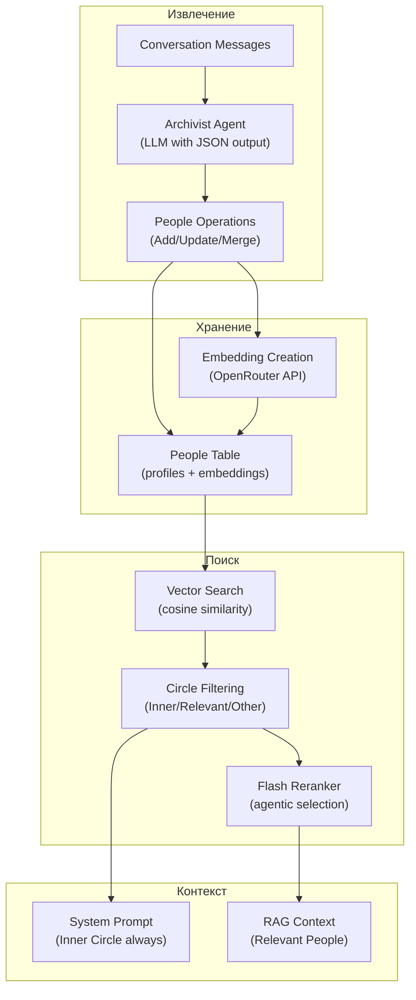
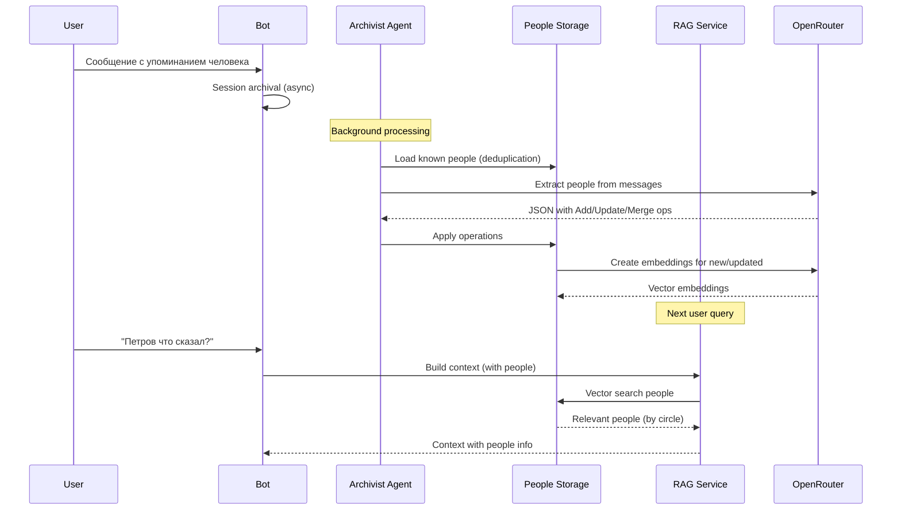

# People Graph

Этот документ описывает архитектуру социального графа — системы извлечения и поиска людей, упомянутых в разговорах.

## Обзор

People Graph (v0.5.1) — это компонент долгосрочной памяти, который:
- Извлекает людей из разговоров (имена, @username, связи)
- Хранит профили с категоризацией по кругам общения
- Создаёт embeddings для семантического поиска
- Интегрируется в RAG для контекстуальных ответов

**Пример использования:**
```
User: "Помнишь, мы с Петровым обсуждали проект?"
Bot: [видит Петрова в Work_Inner, находит топики про проект]
```

## Архитектура

### Компоненты



### Поток данных



## Модель данных

### Структура Person

```go
type Person struct {
    ID           int64     `json:"id"`            // Уникальный ID
    UserID       int64     `json:"user_id"`       // Владелец профиля
    DisplayName  string    `json:"display_name"`  // Основное имя
    Aliases      []string  `json:"aliases"`       // Альтернативные имена
    TelegramID   *int64    `json:"telegram_id"`   // Telegram ID для @mention
    Username     *string   `json:"username"`      // @username без @
    Circle       string    `json:"circle"`        // Категория (Family/Friends/Work...)
    Bio          string    `json:"bio"`           // Профиль (2-3 предложения)
    Embedding    []float32 `json:"embedding"`     // Вектор для поиска
    FirstSeen    time.Time `json:"first_seen"`
    LastSeen     time.Time `json:"last_seen"`
    MentionCount int       `json:"mention_count"` // Сколько раз упоминался
}
```

### Люди и их круги

**Circle** — категоризация людей по степени близости:

| Circle | Описание | Включение в контекст |
|--------|----------|---------------------|
| `Family` | Близкие родственники | Всегда в system prompt |
| `Work_Inner` | Близкие коллеги | Всегда в system prompt |
| `Friends` | Друзья | Через reranker |
| `Work_Outer` | Коллеги-знакомые | Через reranker |
| `Other` | Остальные | Через reranker |

**Логика включения:**
- **Inner Circle** (Family + Work_Inner) — всегда в system prompt как `<inner_circle>`
- **Relevant People** (Friends + Work_Outer + Other) — выбираются reranker'ом как `<relevant_people>`

## Извлечение людей

### Archivist Agent

**Расположение:** `internal/agent/archivist/archivist.go`

**Входные данные:**
- Сообщения для обработки
- Текущие факты о пользователе
- Известные люди (для дедупликации)
- Профиль пользователя

**Выходные операции (JSON):**

| Операция | Описание | Пример |
|----------|----------|--------|
| `Added` | Новый человек | Добавлен Петров с bio "Коллега по проекту X" |
| `Updated` | Обновление существующего | Добавлен alias "Гелёй" к Марии |
| `Merged` | Объединение дубликатов | Maria Ivanovna = Maria (один человек) |

**Особенности:**
- Детекция вариаций имён (prefix matching)
- Агрегация био из нескольких упоминаний
- Определение круга общения из контекста

### Обработка операций

```go
// internal/memory/memory.go
func (s *Service) ProcessSession(ctx context.Context, session *Session) error {
    // 1. Загружаем текущих людей для дедупликации
    people, _ := s.peopleRepo.GetPeople(ctx, userID)

    // 2. Archivist извлекает операции
    response := s.archivist.Execute(ctx, agent.Request{
        Messages: messages,
        People:   people,
        Facts:    facts,
    })

    // 3. Применяем операции
    for _, op := range response.PeopleOperations {
        switch op.Type {
        case "Added":
            s.addPerson(op.Person)
        case "Updated":
            s.updatePerson(op.Person)
        case "Merged":
            s.mergePeople(op.SourceID, op.TargetID)
        }
    }

    // 4. Создаём embeddings для новых/обновлённых
    s.createEmbeddings(changedPeople)
}
```

### Создание Embeddings

**Текст для векторизации:**
```go
input := fmt.Sprintf("%s %s %s %s",
    person.DisplayName,
    person.Username,
    strings.Join(person.Aliases, " "),
    person.Bio,
)
```

**API:** OpenRouter с `google/gemini-embedding-001`
- Размерность: 3072
- Нормализация: L2 normalized

### Дедупликация

**Проблема:** Один человек может упоминаться по-разному:
- "Мария", "Маша", "Maria Ivanovna"
- "@username", "Иван Фёдорович"

**Решение:**
1. **Prefix matching** — схожие имена объединяются
2. **@username matching** — точное совпадение username
3. **Telegram ID matching** — точное совпадение Telegram ID
4. **LLM-merging** — Archivist предлагает объединение дубликатов

## Поиск людей

### Vector Search

**Расположение:** `internal/rag/retrieval.go`

```go
func (s *Service) SearchPeople(
    ctx context.Context,
    userID int64,
    embedding []float32,
    threshold float32,      // Минимальное сходство
    maxResults int,         // Максимум результатов
    excludeCircles []string, // Исключить из поиска
) ([]PersonSearchResult, error)
```

**Алгоритм:**
1. Косинусное сходство query embedding vs все people embeddings
2. Фильтрация по threshold
3. Исключение Inner Circle (уже в system prompt)
4. Сортировка по score
5. Top-N результатов

### Категория людей

| Тег | Круги | Использование |
|-----|-------|---------------|
| `<inner_circle>` | Family, Work_Inner | Всегда в system prompt |
| `<relevant_people>` | Friends, Work_Outer, Other | Выбирается reranker'ом |
| `<people>` | Все люди | Полный список (для LLM-анализа) |

### Reranker Integration

**Flash Reranker** видит:
- Query (contextualized)
- 50 top people summaries
- Выбирает 0-10 релевантных людей

**Формат кандидата:**
```
[Person:42] Петров | Work_Inner | 127 mentions | Коллега по проекту X, ...
[Person:18] Мария | Friends | 45 mentions | Близкая подруга, ...
```

**Формат результата:**
```json
{
  "people": [
    {"id": 42, "reason": "Коллега по упомянутому проекту"},
    {"id": 18, "reason": "Упомянута в контексте встречи"}
  ]
}
```

## Конфигурация

### Настройки агента

```yaml
agents:
  archivist:
    model: "google/gemini-2-flash-thinking"
    temperature: 0.0
    max_tokens: 4096

  reranker:
    enabled: true
    model: "google/gemini-3-flash-preview"
    max_people: 10
    timeout: "60s"
```

### Настройки RAG

```yaml
rag:
  retrieval:
    people_threshold: 0.65      # Минимальное сходство для людей
    retrieved_people_count: 10  # Максимум людей из vector search
```

## Ключевые решения

### 1. Почему отдельная таблица People

**Альтернативы:**
- Искать людей в topics — много шуму
- Хранить в facts — нет структуры для связей

**Преимущества отдельной таблицы:**
- Структурированные профили (bio, circle, aliases)
- Эффективный поиск по embeddings
- Отслеживание упоминаний (mention_count)
- Простая интеграция с RAG

### 2. Почему категоризация по кругам

**Проблема:** Все люди в одном списке → много шума в контексте.

**Решение:** Inner Circle всегда в system prompt, остальные — через reranker.

**Эффект:**
- Inner Circle (2-5 человек) — всегда в контексте
- Relevant People (0-10) — выбираются по запросу
- Контекст остаётся компактным

### 3. Почему embeddings для людей

**Проблема:** Точный поиск по имени работает плохо (вариации, опечатки).

**Решение:** Семантический поиск по bio + aliases.

**Пример:**
```
Query: "начальник из проекта X"
Matches: Петров (bio: "Руководитель проекта X")
Score: 0.87
```

### 4. Почему Merge операция

**Проблема:** LLM может извлечь одного человека как двух разных.

**Решение:**
- Archivist предлагает merge
- Storage объединяет профили
- Старый ID удаляется

**Объединение:**
```go
func (r *SQLitePersonRepository) MergePeople(ctx context.Context, sourceID, targetID int64) error {
    // 1. Объединяем aliases
    // 2. Берём максимальный mention_count
    // 3. Удаляем source
}
```

## Метрики

### People Extraction

| Метрика | Тип | Labels | Описание |
|---------|-----|--------|----------|
| `laplaced_people_extracted_total` | counter | user_id, op_type | Add/Update/Merge операции |
| `laplaced_people_extraction_duration_seconds` | histogram | user_id | Время извлечения (Archivist) |
| `laplaced_people_duplicates_merged_total` | counter | user_id | Успешные merge |

### People Search

| Метрика | Тип | Labels | Описание |
|---------|-----|--------|----------|
| `laplaced_people_search_duration_seconds` | histogram | user_id | Время vector search |
| `laplaced_people_search_results` | histogram | user_id | Количество найденных людей |
| `laplaced_people_reranker_selected` | histogram | user_id | Выбрано reranker'ом |

### People Storage

| Метрика | Тип | Labels | Описание |
|---------|-----|--------|----------|
| `laplaced_people_total` | gauge | user_id, circle | Общее количество людей |
| `laplaced_people_mentions_total` | counter | person_id | Сумма mention_count |

## Edge Cases

| Ситуация | Поведение |
|----------|-----------|
| Человек без имени | Пропускается (требуется DisplayName) |
| Дубликаты по имени | Suggest merge через Archivist |
| Один человек — разные круги | Обновляется circle (последний wins) |
| Пустой bio | Создаётся из DisplayName + Aliases |
| Нет @username | TelegramID = null |

## История изменений

- **v0.5.1** — начальная реализация People Graph
  - Архитектура social graph
  - Категоризация по кругам
  - Vector search по людям
  - Интеграция с Flash Reranker

## Связанные документы

- [Embedding Storage](./embedding-storage.md) — хранение векторов
- [Flash Reranker](./flash-reranker.md) — agentic фильтрация
- [Message Processing Flow](./message-processing-flow.md) — общий flow

## Связанные файлы

- `internal/agent/archivist/` — извлечение людей
- `internal/storage/sqlite_person.go` — хранение людей
- `internal/rag/retrieval.go` — vector search
- `internal/storage/format.go` — форматирование людей для LLM
