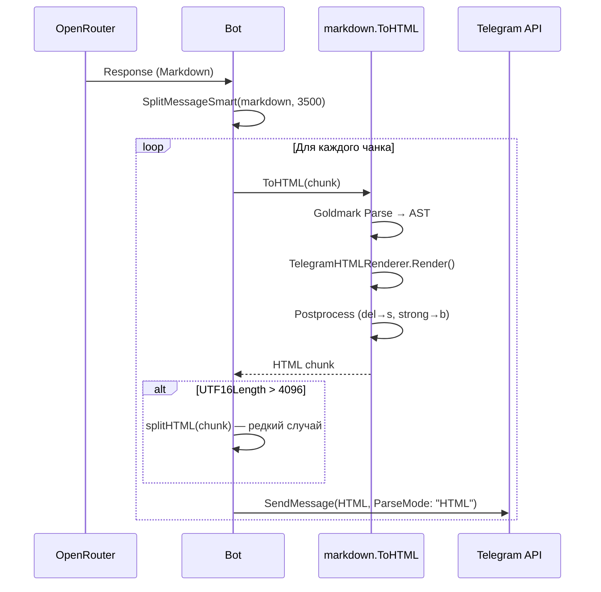

# Telegram HTML Rendering

Этот документ описывает систему конвертации Markdown в Telegram-совместимый HTML и принятые архитектурные решения.

## Обзор

LLM генерирует ответы в стандартном Markdown. Перед отправкой в Telegram текст конвертируется в HTML с учётом ограничений Telegram Bot API.

```
LLM Response (Markdown)
    → telegram.SplitMessageSmart()  [разбиение на чанки]
    → markdown.ToHTML()             [конвертация каждого чанка]
    → SendMessage(ParseMode: HTML)
```

## Архитектура

### Компоненты

```mermaid
flowchart TB
    subgraph input["Входные данные"]
        A[LLM Response - Markdown]
    end

    subgraph goldmark["Goldmark Parser"]
        B[Lexer → AST]
        C[GFM Extension - strikethrough, tables]
        D[Spoiler Extension - custom spoiler syntax]
    end

    subgraph renderer["TelegramHTMLRenderer"]
        E1[Text → html.EscapeString]
        E2["**bold** → &lt;b&gt;"]
        E3["*italic* → &lt;i&gt;"]
        E4["`code` → &lt;code&gt;"]
        E5["```lang → &lt;pre&gt;&lt;code class=...&gt;"]
        E6["[text](url) → &lt;a href=...&gt;"]
        E7["> quote → &lt;blockquote&gt;"]
        E8["||spoiler|| → &lt;tg-spoiler&gt;"]
        E9["- item → • item (эмуляция)"]
        E10["| table | → &lt;pre&gt; monospace"]
    end

    subgraph postprocess["Постобработка"]
        F1["&lt;del&gt; → &lt;s&gt;"]
        F2["&lt;strong&gt; → &lt;b&gt;"]
        F3["&lt;em&gt; → &lt;i&gt;"]
        F4["checkbox → ☑/☐"]
    end

    subgraph output["Выход"]
        G[Telegram HTML]
    end

    input --> goldmark
    goldmark --> renderer
    renderer --> postprocess
    postprocess --> output
```

### Структура файлов

```
internal/markdown/
├── html.go           # Основной конвертер (722 строки)
│   ├── TelegramHTMLRenderer  # Кастомный рендерер Goldmark
│   ├── ToHTML()              # Публичная функция конвертации
│   ├── formatTableVertical() # Рендеринг таблиц
│   └── UTF16Length()         # Подсчёт длины для Telegram
├── html_test.go      # Тесты (coverage 70.5%)
├── spoiler.go        # Расширение для ||spoiler|| (137 строк)
│   ├── SpoilerNode           # AST узел
│   ├── spoilerParser         # Inline парсер для ||
│   └── SpoilerExtension      # Goldmark extension
└── spoiler_test.go   # Тесты спойлеров
```

## Ключевые решения

### 1. Почему HTML вместо MarkdownV2

**Проблема с MarkdownV2:**
- Требует экранирования 18+ символов: `_*[]()~>#+=\|{}.!-`
- LLM генерирует невалидную разметку (незакрытые теги, вложенные конструкции)
- При ошибке парсинга Telegram отклоняет всё сообщение
- Сложный эскейпер (193 строки) с рекурсивным парсингом

**Преимущества HTML:**
- Экранирование только 3 символов: `<`, `>`, `&`
- Чёткая структура тегов
- Goldmark — зрелая библиотека с расширяемым API
- При ошибке можно отправить как plain text (fallback)

### 2. Кастомный рендерер вместо стандартного HTML

**Проблема:** Стандартный HTML рендерер Goldmark генерирует `<p>`, `<ul>`, `<ol>` — теги, которые Telegram не поддерживает.

**Решение:** `TelegramHTMLRenderer` переопределяет рендеринг для каждого типа AST-узла:

```go
type TelegramHTMLRenderer struct {
    ghtml.Config
    // Table rendering state
    tableData   [][]string
    currentRow  []string
    currentCell *bytes.Buffer
    alignments  []extast.Alignment
}

func (r *TelegramHTMLRenderer) RegisterFuncs(reg renderer.NodeRendererFuncRegisterer) {
    reg.Register(ast.KindHeading, r.renderHeading)      // → <b>
    reg.Register(ast.KindList, r.renderList)            // → bullets
    reg.Register(ast.KindBlockquote, r.renderBlockquote) // → <blockquote>
    reg.Register(extast.KindTable, r.renderTable)       // → <pre> monospace
    // ... 20+ handlers
}
```

### 3. Таблицы в вертикальном формате

**Проблема:** Telegram не поддерживает `<table>`. Горизонтальный формат плохо читается на мобильных устройствах и имеет проблемы с выравниванием при HTML entities.

**Решение:** Таблицы рендерятся в вертикальном формате (одна запись на блок):

```
Markdown:
| Name | Age |
|------|-----|
| Alice | 30 |
| Bob   | 25 |

Telegram HTML:
<pre>
Name: Alice
Age : 30
──────────
Name: Bob
Age : 25
</pre>
```

**Реализация:**
```go
func (r *TelegramHTMLRenderer) renderTable(w util.BufWriter, source []byte, n ast.Node, entering bool) {
    if entering {
        r.tableData = [][]string{}  // Накапливаем данные
    } else {
        tableText := formatTableVertical(r.tableData)  // Рендерим
        w.WriteString("<pre>" + tableText + "</pre>")
    }
}
```

### 4. Кастомное расширение для спойлеров

**Проблема:** Синтаксис двойных вертикальных черт для спойлеров — нестандартный Markdown (Discord/Telegram).

**Решение:** Кастомное Goldmark расширение:

```go
// AST узел
type SpoilerNode struct {
    ast.BaseInline
}

// Inline парсер для ||
type spoilerParser struct{}

func (s *spoilerParser) Trigger() []byte {
    return []byte{'|'}
}

func (s *spoilerParser) Parse(...) ast.Node {
    // Ищем || ... ||
    if line[0] == '|' && line[1] == '|' {
        // Находим закрывающий ||
        // Создаём SpoilerNode
    }
}

// Рендерер
func (r *SpoilerHTMLRenderer) renderSpoiler(...) {
    if entering {
        w.WriteString("<tg-spoiler>")
    } else {
        w.WriteString("</tg-spoiler>")
    }
}
```

### 5. Подсчёт длины в UTF-16 code units

**Проблема:** Telegram считает длину сообщения в UTF-16 code units, не в байтах или символах. Emoji и редкие символы занимают 2 code units.

**Решение:**
```go
func UTF16Length(s string) int {
    return len(utf16.Encode([]rune(s)))
}
```

**Использование:**
- `SplitMessageSmart` использует консервативный лимит 3500 символов для Markdown
- После конвертации в HTML проверяется UTF-16 длина
- Если > 4096, дополнительное разбиение (редкий случай)

### 6. Постобработка для совместимости

**Проблема:** GFM генерирует некоторые теги, которые Telegram не понимает.

**Решение:** Замена после рендеринга:
```go
// GFM strikethrough → Telegram strikethrough
result = strings.ReplaceAll(result, "<del>", "<s>")
result = strings.ReplaceAll(result, "</del>", "</s>")

// Semantic tags → presentation tags
result = strings.ReplaceAll(result, "<strong>", "<b>")
result = strings.ReplaceAll(result, "<em>", "<i>")

// GFM task lists → Unicode checkboxes
result = strings.ReplaceAll(result, `<input checked="" ...>`, "☑")
result = strings.ReplaceAll(result, `<input disabled="" ...>`, "☐")
```

### 7. Raw HTML пропускается

**Проблема:** LLM иногда генерирует `<script>`, `<div>` и другой HTML.

**Решение:** Узлы `HTMLBlock` и `RawHTML` игнорируются:
```go
func (r *TelegramHTMLRenderer) renderHTMLBlock(...) {
    return ast.WalkSkipChildren, nil  // Skip raw HTML for security
}
```

## Маппинг элементов

| Markdown | AST Node | Telegram HTML |
|----------|----------|---------------|
| `**bold**` | Emphasis(2) | `<b>bold</b>` |
| `*italic*` | Emphasis(1) | `<i>italic</i>` |
| `~~strike~~` | Strikethrough | `<s>strike</s>` |
| двойные `||` | SpoilerNode | `<tg-spoiler>spoiler</tg-spoiler>` |
| `` `code` `` | CodeSpan | `<code>code</code>` |
| ` ```lang ` | FencedCodeBlock | `<pre><code class="language-lang">` |
| `[text](url)` | Link | `<a href="url">text</a>` |
| `> quote` | Blockquote | `<blockquote>quote</blockquote>` |
| `# Heading` | Heading | `<b>Heading</b>` |
| `- item` | ListItem | `• item` |
| `1. item` | ListItem(ordered) | `1. item` |
| `| table |` | Table | `<pre>vertical format</pre>` |
| `---` | ThematicBreak | `\n` |

## Поток данных



## Edge Cases

| Случай | Поведение |
|--------|-----------|
| Незакрытые теги в Markdown | Goldmark парсит как plain text |
| Вложенное форматирование | Поддерживается: `**bold *and italic***` |
| Спецсимволы `<>&` | Экранируются через `html.EscapeString()` |
| Спецсимволы в коде | Экранируются внутри `<code>` |
| URL со спецсимволами | Не экранируются (кроме `"` → `&quot;`) |
| Пустые теги | Goldmark не генерирует |
| Inline изображения | Пропускаются (Telegram не поддерживает) |
| Raw HTML в Markdown | Пропускается (безопасность) |

## Fallback стратегия

При ошибке парсинга или отправки:

```go
htmlChunk, err := markdown.ToHTML(chunk)
if err != nil {
    // Fallback: отправляем как plain text
    htmlChunk = html.EscapeString(chunk)
}

_, err = b.api.SendMessage(ctx, telegram.SendMessageRequest{
    Text:      htmlChunk,
    ParseMode: "HTML",
})
if err != nil {
    // Retry без ParseMode
    b.api.SendMessage(retryCtx, telegram.SendMessageRequest{
        Text: stripHTML(htmlChunk),
    })
}
```

## Производительность

- Goldmark использует AST с single-pass rendering
- Нет regex для парсинга Markdown (кроме постобработки таблиц)
- Память: O(n) где n — размер входного текста
- Типичное время: < 1ms на сообщение

## Метрики

| Метрика | До (MarkdownV2) | После (HTML) |
|---------|-----------------|--------------|
| Ошибки парсинга | ~5% сообщений | ~0% |
| Строки кода | ~320 (escaper) | ~860 (html + spoiler) |
| Покрытие тестами | ~60% | 70.5% |
| Поддержка таблиц | Нет | Да (vertical) |
| Поддержка спойлеров | Нет | Да |

## Идеи для улучшения

### 1. Expandable Blockquotes

Telegram поддерживает `<blockquote expandable>` для длинных цитат:
```go
func (r *TelegramHTMLRenderer) renderBlockquote(...) {
    // Если цитата > 200 символов, делаем expandable
    if entering && contentLength > 200 {
        w.WriteString("<blockquote expandable>")
    }
}
```

### 2. Syntax Highlighting Preview

Добавить в Web UI превью подсветки синтаксиса для отладки:
- Показывать какой язык определён
- Предупреждать если язык не в [списке Telegram](https://github.com/TelegramMessenger/libprisma#supported-languages)

### 3. Кэширование Goldmark Instance

Сейчас `goldmark.New()` вызывается при каждом `ToHTML()`. Можно создать singleton:
```go
var mdInstance = goldmark.New(
    goldmark.WithExtensions(...),
    goldmark.WithRenderer(...),
)

func ToHTML(markdown string) (string, error) {
    var buf bytes.Buffer
    mdInstance.Convert([]byte(markdown), &buf)
    // ...
}
```

### 4. Поддержка Underline

Telegram поддерживает `<u>underline</u>`, но стандартный Markdown — нет. Можно добавить кастомный синтаксис `__underline__`:
```go
type UnderlineExtension struct{}

func (e *UnderlineExtension) Extend(m goldmark.Markdown) {
    // Парсер для __ ... __
}
```

### 5. Метрики конвертации

Добавить Prometheus метрики:
- `markdown_to_html_duration_seconds` — время конвертации
- `markdown_to_html_errors_total` — ошибки парсинга
- `telegram_message_length_utf16` — распределение длины сообщений

## Связанные файлы

- `internal/markdown/html.go` — основной конвертер
- `internal/markdown/spoiler.go` — расширение для спойлеров
- `internal/telegram/message_splitter.go` — разбиение сообщений
- `internal/bot/process_group.go` — вызов `ToHTML()` и отправка
- `internal/i18n/locales/*.yaml` — инструкции для LLM по форматированию

## Ссылки

- [Telegram Bot API - Formatting options](https://core.telegram.org/bots/api#html-style)
- [Goldmark GitHub](https://github.com/yuin/goldmark)
- [GFM Specification](https://github.github.com/gfm/)
- [Telegram Syntax Highlighting Languages](https://github.com/TelegramMessenger/libprisma#supported-languages)
