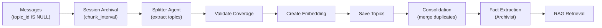
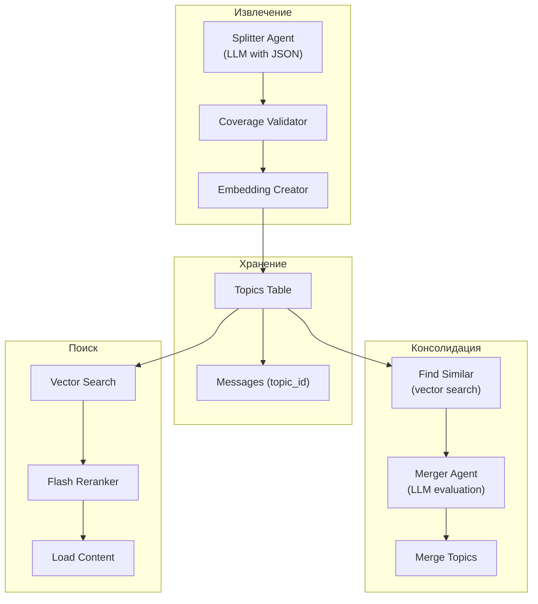
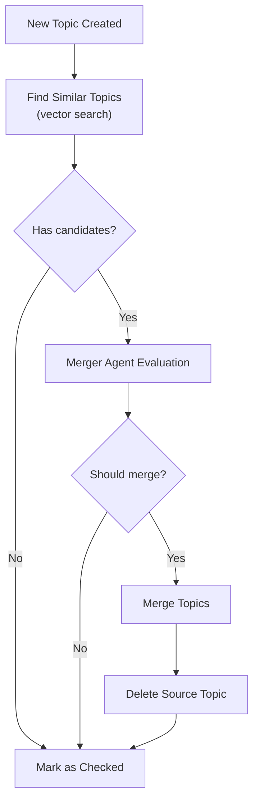

# Topics

Этот документ описывает архитектуру системы топиков — сжатых саммари прошлых разговоров для долгосрочной памяти.

## Обзор

Topics — это основной компонент долгосрочной памяти RAG системы:
- **Session → Topics**: длинные разговоры сжимаются в топики
- **Topics → Embeddings**: векторные представления для семантического поиска
- **RAG Retrieval**: топики находятся через vector search + reranker
- **Context Assembly**: релевантные топики включаются в контекст LLM

**Пример:**
```
2 часа разговора про Docker → Topic: "Настройка Docker Compose для ML-инфраструктуры"
```

## Архитектура

### Жизненный цикл топика



### Компоненты



## Модель данных

### Структура Topic

```go
type Topic struct {
    ID                   int64     `json:"id"`              // Уникальный ID
    UserID               int64     `json:"user_id"`         // Владелец
    Summary              string    `json:"summary"`         // Сжатое саммари разговора
    StartMsgID           int64     `json:"start_msg_id"`    // Первое сообщение
    EndMsgID             int64     `json:"end_msg_id"`      // Последнее сообщение
    SizeChars            int       `json:"size_chars"`      // Размер в символах
    Embedding            []float32 `json:"embedding"`       // Вектор для поиска
    FactsExtracted       bool      `json:"facts_extracted"` // Факты извлечены?
    IsConsolidated       bool      `json:"is_consolidated"` // Объединён с другим?
    ConsolidationChecked bool      `json:"consolidation_checked"` // Проверен на дубликаты?
    CreatedAt            time.Time `json:"created_at"`
}
```

### Связи

```
User (1) ←→ (N) Topics
Topic (1) ←→ (N) Messages [via start_msg_id, end_msg_id]
Topic (1) ←→ (N) Facts [extracted from topic messages]
```

## Создание топиков

### Session Archival

**Триггеры:**
- **Inactivity timeout**: пауза ≥ `rag.chunk_interval` (по умолчанию 1 час)
- **Max size**: накопилось ≥ `rag.max_chunk_size` сообщений (400)

**Логика:**
```go
// internal/rag/processing.go
func (s *Service) ProcessStaleSessions(ctx context.Context) error {
    // 1. Находим сессии без topic_id
    sessions, _ := s.messageRepo.GetStaleSessions(ctx, chunkInterval)

    for _, session := range sessions {
        // 2. Группируем по размеру
        chunks := s.splitBySize(session.Messages, maxChunkSize)

        for _, chunk := range chunks {
            // 3. Extract topics via Splitter
            topics := s.splitterAgent.Execute(ctx, chunk)

            // 4. Save topics
            s.saveTopics(ctx, topics)
        }
    }
}
```

### Splitter Agent

**Расположение:** `internal/agent/splitter/splitter.go`

**Входные данные:**
- Сообщения сессии (text + metadata)
- Профиль пользователя (для контекста)

**Выходные данные (JSON):**
```json
{
  "topics": [
    {
      "summary": "Обсуждение настройки Docker Compose",
      "start_msg_id": 12345,
      "end_msg_id": 12367
    }
  ],
  "stragglers": []  // Сообщения не вошедшие в топики (должен быть пустым)
}
```

**Принципы:**
- Топики определяются по **запросам пользователя**, не ответам бота
- Каждый message должен быть в одном топике
- Пересечения не допускаются

### Валидация покрытия

**Проблема:** LLM может пропустить сообщения.

**Решение:**
```go
func validateCoverage(messages []Message, topics []Topic) error {
    covered := make(map[int64]bool)

    for _, topic := range topics {
        for msgID := topic.StartMsgID; msgID <= topic.EndMsgID; msgID++ {
            covered[msgID] = true
        }
    }

    var uncovered []int64
    for _, msg := range messages {
        if !covered[msg.ID] {
            uncovered = append(uncovered, msg.ID)
        }
    }

    if len(uncovered) > 0 {
        return fmt.Errorf("uncovered messages: %v", uncovered)
    }
    return nil
}
```

**Fallback:** Если есть uncovered — создаём топик "General conversation".

### Создание Embeddings

**Текст для векторизации:**
```go
input := fmt.Sprintf("Topic Summary: %s\n\nConversation Log:\n%s",
    topic.Summary,
    conversationLog,  // [User]: ..., [Assistant]: ...
)
```

**API:** OpenRouter с `google/gemini-embedding-001`
- Размерность: 3072
- Нормализация: L2 normalized

### Сохранение топиков

```go
func (s *Service) saveTopics(ctx context.Context, topics []Topic) error {
    for _, topic := range topics {
        // 1. Clamp IDs to actual message range
        topic.StartMsgID = clamp(topic.StartMsgID, minMsgID, maxMsgID)
        topic.EndMsgID = clamp(topic.EndMsgID, minMsgID, maxMsgID)

        // 2. Create embedding
        topic.Embedding = s.createEmbedding(ctx, topic)

        // 3. Save topic
        topicID, _ := s.topicRepo.AddTopic(ctx, topic)

        // 4. Update messages
        s.messageRepo.UpdateTopicIDs(ctx, topic.StartMsgID, topic.EndMsgID, topicID)

        // 5. Schedule consolidation check
        s.scheduleConsolidation(ctx, topicID)
    }
}
```

## Консолидация топиков

### Зачем нужна консолидация

**Проблема:** Один разговор может быть разбит на несколько топиков:
- Session 1: "Обсуждение Docker"
- Session 2: "Продолжение про Docker"
- Session 3: "Ещё про Docker"

**Решение:** Объединить похожие топики в один.

### Процесс консолидации



### Поиск похожих топиков

```go
func (s *Service) findConsolidationCandidates(ctx context.Context, topicID int64) ([]Topic, error) {
    topic, _ := s.topicRepo.GetTopic(ctx, topicID)

    // Vector search по embeddings
    results, _ := s.vectorSearch(ctx, topic.Embedding, threshold, maxCandidates)

    // Фильтруем:
    // - Исключаем сам топик
    // - Только не консолидированные
    // - Разные пользователи (user isolation)

    return candidates, nil
}
```

### Merger Agent

**Расположение:** `internal/agent/merger/merger.go`

**Входные данные:**
```json
{
  "topic1": {
    "summary": "Настройка Docker Compose",
    "messages": [...]
  },
  "topic2": {
    "summary": "Docker compose troubleshooting",
    "messages": [...]
  }
}
```

**Выходные данные:**
```json
{
  "should_merge": true,
  "reason": "Оба топика про настройку Docker Compose, один продолжение другого",
  "merged_summary": "Настройка и troubleshooting Docker Compose для ML-инфраструктуры"
}
```

### Слияние топиков

```go
func (r *SQLiteTopicRepository) MergeTopics(ctx context.Context, sourceID, targetID int64) error {
    source, _ := r.GetTopic(ctx, sourceID)
    target, _ := r.GetTopic(ctx, targetID)

    // 1. Расширяем границы target
    if source.StartMsgID < target.StartMsgID {
        target.StartMsgID = source.StartMsgID
    }
    if source.EndMsgID > target.EndMsgID {
        target.EndMsgID = source.EndMsgID
    }

    // 2. Объединяем размер
    target.SizeChars += source.SizeChars

    // 3. Обновляем саммари
    target.Summary = mergedSummary

    // 4. Пересоздаём embedding
    target.Embedding = createEmbedding(target)

    // 5. Обновляем сообщения
    r.messageRepo.UpdateTopicIDs(ctx, source.StartMsgID, source.EndMsgID, targetID)

    // 6. Удаляем source
    r.DeleteTopic(ctx, sourceID)

    return nil
}
```

## Поиск топиков

### Vector Search

```go
func (s *Service) SearchTopics(
    ctx context.Context,
    userID int64,
    embedding []float32,
    threshold float32,
    maxResults int,
) ([]TopicSearchResult, error)
```

**Алгоритм:**
1. Косинусное сходство query embedding vs все topic embeddings
2. Фильтрация по threshold
3. Сортировка по score
4. Top-N результатов

### Reranker Filtering

**Flash Reranker** (агентская фильтрация):
- Видит 50 summaries (~3K tokens)
- Tool call `get_topics_content([ids])` для загрузки
- Выбирает 0-15 релевантных топиков
- Возвращает reason + excerpt для больших топиков

**Детали:** см. [Flash Reranker](./flash-reranker.md)

### Загрузка содержимого

```go
func (s *Service) LoadTopicContent(ctx context.Context, topicID int64) (string, error) {
    topic, _ := s.topicRepo.GetTopic(ctx, topicID)

    // Для топиков > 25K chars — используем excerpt из reranker
    if topic.SizeChars > 25000 && topic.Excerpt != "" {
        return topic.Excerpt, nil
    }

    // Иначе загружаем сообщения
    messages, _ := s.messageRepo.GetMessagesByTopicID(ctx, topicID)
    return formatMessages(messages), nil
}
```

## Конфигурация

### Настройки извлечения

```yaml
rag:
  chunk_interval: 1h         # Таймаут неактивности перед archival
  max_chunk_size: 400        # Максимум сообщений в чанке
  split_threshold_chars: 25000 # Порог для разделения больших чанков
```

### Настройки консолидации

```yaml
rag:
  consolidation_similarity_threshold: 0.85  # Порог для merge candidates
  max_merged_size_chars: 50000             # Максимум после merge
  consolidation_batch_size: 10              # Сколько проверять за раз
```

### Настройки поиска

```yaml
rag:
  retrieval:
    topics_threshold: 0.60       # Минимальное сходство
    retrieved_topics_count: 50   # Для reranker
```

## Ключевые решения

### 1. Почему topiсs, не просто history search

**Проблема:** Полный поиск по истории = слишком много токенов.

**Решение:** Сжатые саммари (topics) + загрузка сообщений по запросу.

**Эффект:**
- 100K сообщений → 1K топиков
- Vector search по 1K векторов быстро
- Reranker выбирает 5-15 релевантных
- Итого: ~5-10K токенов вместо 100K+

### 2. Почему Splitter + Merger

**Двухэтапный подход:**
1. **Splitter**: быстрая сегментация по запросам
2. **Merger**: медленная консолидация дубликатов

**Преимущества:**
- Splitter не должен думать о глобальной консистентности
- Консолидация асинхронная, не блокирует archival
- Можно регулировать агрессивность merge через threshold

### 3. Почему embeddings для summary + log

**Варианты:**
- Только summary → мало контекста
- Только messages → много шума

**Решение:** Summary + Conversation Log

**Эффект:**
- Summary даёт high-level контекст
- Log даёт конкретные детали
- Вектор отражает и тему, и содержание

### 4. Почему coverage validation

**Проблема:** LLM может пропустить сообщения → потеря данных.

**Решение:** Обязательная валидация покрытия.

**Fallback:** Create "General conversation" topic for stragglers.

### 5. Почему message ranges, not IDs

**Варианты:**
- `[]int64` message IDs → много данных в topic
- `start_msg_id, end_msg_id` → компактно

**Преимущества ranges:**
- Компактное хранение (2 int vs N int)
- Быстрая проверка overlaps
- Простой merge (min/max)

## Метрики

### Topic Extraction

| Метрика | Тип | Labels | Описание |
|---------|-----|--------|----------|
| `laplaced_topics_extracted_total` | counter | user_id | Создано топиков |
| `laplaced_splitter_duration_seconds` | histogram | user_id | Время Splitter агента |
| `laplaced_topics_size_chars` | histogram | user_id | Размер топиков |
| `laplaced_topics_coverage_gaps_total` | counter | user_id | Сообщений не вошедших в топики |

### Topic Consolidation

| Метрика | Тип | Labels | Описание |
|---------|-----|--------|----------|
| `laplaced_topics_merged_total` | counter | user_id | Объединено топиков |
| `laplaced_merger_duration_seconds` | histogram | user_id | Время Merger агента |
| `laplaced_topics_consolidation_candidates` | histogram | user_id | Кандидатов на merge |

### Topic Retrieval

| Метрика | Тип | Labels | Описание |
|---------|-----|--------|----------|
| `laplaced_topics_search_duration_seconds` | histogram | user_id | Время vector search |
| `laplaced_topics_search_results` | histogram | user_id | Найдено топиков |
| `laplaced_topics_reranker_selected` | histogram | user_id | Выбрано reranker'ом |

## Edge Cases

| Ситуация | Поведение |
|----------|-----------|
| Пустой summary | Error (summary обязателен) |
| Uncovered messages | Создаём "General conversation" |
| Overlapping topics | Split по времени (earlier wins) |
| Too large topic | Split на под-топики |
| Merge > max_size | Не merge, создаём новый |

## Связанные документы

- [Flash Reranker](./flash-reranker.md) — agentic фильтрация топиков
- [Embedding Storage](./embedding-storage.md) — хранение векторов
- [Message Processing Flow](./message-processing-flow.md) — общий flow
- [Graceful Shutdown](./graceful-shutdown.md) — обработка при shutdown

## Связанные файлы

- `internal/agent/splitter/` — извлечение топиков
- `internal/agent/merger/` — консолидация топиков
- `internal/storage/sqlite_topic.go` — хранение топиков
- `internal/rag/processing.go` — обработка сессий
- `internal/rag/retrieval.go` — vector search
