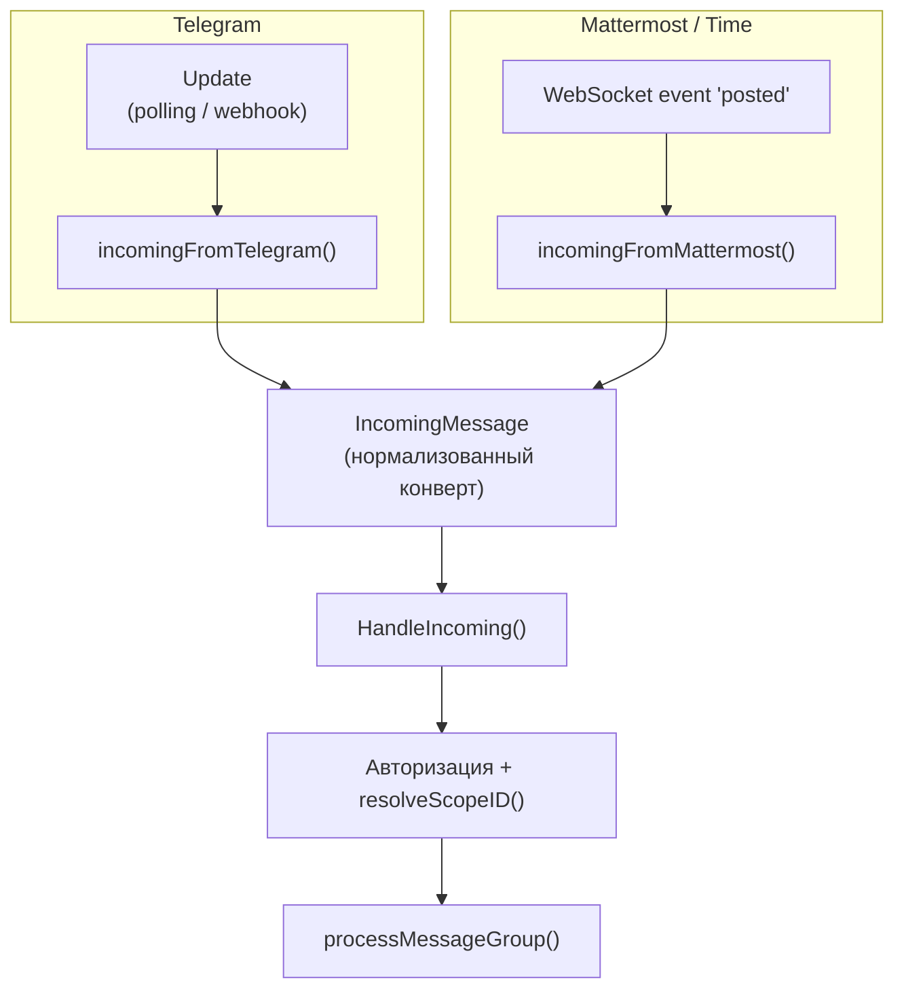

# Transports (Telegram / Mattermost)

Этот документ описывает абстракцию транспорта — слой, который позволяет одному и
тому же ядру бота работать поверх разных мессенджеров (Telegram и
Mattermost-совместимый Time), и связанную с ней модель идентичности (`ScopeID`,
principal resolution).

## Обзор

Бот общается с пользователем через интерфейс `Transport`
(`internal/bot/transport.go`). Приём сообщений (ingestion) — транспортно-специфичен
(Telegram polling/webhook vs Mattermost WebSocket), но всё после нормализации в
`IncomingMessage` — общий код. Транспорт выбирается ключом `transport` в конфиге:
`"telegram"` (по умолчанию) или `"mattermost"`.



## Интерфейс Transport

`internal/bot/transport.go`:

```go
type Transport interface {
    SendText(ctx, OutgoingResponse) (msgID string, err error)
    SendMedia(ctx, OutgoingMedia) (msgID string, err error)
    SendTyping(ctx, conversationID string) error
    SetReaction(ctx, conversationID, messageID, emoji string) error
    Kind() string
    Capabilities() Capabilities
    IsAllowed(nativeSenderID string) bool
    AllowlistConfigured() bool
}
```

Реализации: `transport_telegram.go` и `transport_mattermost.go`. Рендеринг
(Markdown → формат мессенджера) вынесен в отдельный интерфейс `Renderer`
(см. [telegram-html-rendering.md](./telegram-html-rendering.md)).

### Capabilities

Чтобы код выше по стеку не ветвился по имени транспорта, каждый транспорт
декларирует свои возможности:

| Поле | Telegram | Mattermost |
|------|----------|------------|
| `MaxMessageLen` | 4096 (UTF-16) | `MaxPostSize` сервера |
| `ParseMode` | `"HTML"` | `""` (нативный Markdown) |
| `SupportsLatex` | false (LaTeX → Unicode) | true (KaTeX на сервере) |
| `SupportsStreaming` | true (editMessageText) | false (один ответ) |
| `SupportsReactions` | true | true |
| `MaxMediaItemsPerGroup` | 10 (альбом) | 5 |
| `EmojiStyle` | `"unicode"` | `"shortcode"` |
| `AvailableReactions` | фикс. набор юникод-эмодзи Bot API | набор шорткодов |

## IncomingMessage

Оба транспорта приводят нативное обновление к одному конверту
(`internal/bot/transport.go`):

| Поле | Telegram | Mattermost |
|------|----------|------------|
| `ConversationID` | `chat.ID` | `channel_id` |
| `SenderID` | `from.ID` | 26-символьный user id |
| `MessageID` | id сообщения | id поста |
| `IsDirect` | всегда true (личка) | `channel_type == "D"` |
| `ConversationDisplay` | "" | имя канала (для каналов) |
| `ThreadRoot` | `MessageThreadID` | `root_id` / `id` |
| `Mention` | — | бот в `Mentions` |
| `ReplyToBot` | — | пост — ответ на сообщение бота |
| `Forward` | данные пересылки | — |
| `Files` | вложения | вложения из `Metadata.Files` |

## Идентичность: ScopeID

`ScopeID` (`internal/storage/scopeid.go`) — ключ раздела памяти, пришедший на
смену числовому `user_id`. Это строка-UUID; сущности (сообщения, темы, факты,
люди, артефакты) по-прежнему имеют свои int64-id, но **владелец** определяется
через `ScopeID`.

Два способа получить scope:

- **Passthrough (детерминированный):**
  `PassthroughScopeID(transport, nativeID) = uuidv5(namespace, transport+":"+nativeID)`.
  Одна и та же пара (транспорт, нативный id) всегда даёт один и тот же scope.
  Так работает Telegram и любой DM без principal resolver.
- **Principal (случайный):** `MintScopeID() = uuid.New()` — свежий UUID,
  выдаётся при привязке отправителя к «личности» (см. ниже), с дедупликацией
  через таблицу `principals`.

> Namespace-UUID фиксирован навсегда — его смена осиротит все scope.

**`sql.Scanner` / `driver.Valuer`:** `ScopeID` реализует оба. Это критично из-за
динамической типизации SQLite: числовая строка вроде `"123"` приводится к INTEGER
при записи и читается обратно как `int64`. Scanner принимает `int64`/`string`/
`[]byte`, Valuer пишет строкой — round-trip lossless и на SQLite, и на Postgres.

## Разрешение scope и SSO

`resolveScopeID()` (`internal/bot/identity.go`) выбирает scope по ситуации:

1. **Telegram** → всегда passthrough.
2. **Канал** (любой транспорт) → scope канала через `GetOrCreateChannel(...)`.
3. **DM без principal resolver** → passthrough (поведение по умолчанию).
4. **DM с principal resolver:** есть запись в `identities` для (транспорт,
   nativeID)? → переиспользуем scope. Нет → `resolver.Resolve(nativeID)`:
   - untrusted (локальный аккаунт / нет пригодного логина) → изоляция (passthrough);
   - trusted → `GetOrCreatePrincipal()` (свежий или дедуплицированный scope).
   Маппинг сохраняется через `PutIdentity(...)`.

Таблицы (`internal/storage/scopes.go`, `principal.go`): `identities`
((transport, native_id) → scope_id), `principals` (scope_id → object_guid /
ad_login / email / display_name), `scopes` (id → тип/имя).

### Контроль доступа

`internal/bot/bot.go`:

- **Простой режим (resolver не подключён):** статический allowlist транспорта.
  Пустой список = запретить всем (fail-closed). Telegram —
  `bot.allowed_user_ids`; Mattermost — `mattermost.allowed_user_ids`.
- **SSO-режим (resolver подключён):** доступ гейтится `auth_service` аккаунта
  (никогда не самопровозглашённым email; локальные аккаунты с `auth_service == ""`
  не привязываются). Любой trusted SSO-отправитель допускается; если allowlist
  задан, он работает как дополнительный фильтр-подмножество.

Конфиг principal resolver: `mattermost.principal_resolver` (его наличие включает
режим). `trusted_auth_services` ограничивает доверенные `auth_service`;
`access_denied_message` — текст отказа для не-SSO пользователей.

## Mattermost / Time специфика

`internal/mattermost/` — REST-клиент (`client.go`) + WebSocket (`ws.go`):

- REST `/api/v4`: `posts` (отправка), `files` (загрузка медиа),
  `users/{id}` (профиль для principal resolution), `channels/{id}` (имя канала),
  `posts/{id}/reactions` (реакции), typing-индикатор.
- WebSocket: событие `posted`; переподключение с экспоненциальным backoff.
- **Каналы vs DM:** в DM бот всегда отвечает (если авторизован); в канале
  сообщения пассивно сохраняются для контекста, а ответ генерируется только при
  упоминании бота или ответе на его сообщение.
- Входящие файлы: изображения/видео (PDF, voice пропускаются), берутся из
  `post.Metadata.Files`.

## Реакции

Решение об эмодзи общее (Reactor agent, см. [reactor.md](./reactor.md)) и работает
через `Capabilities().AvailableReactions` — без ветвления по транспорту. Различие
только в форме: Telegram — юникод из фиксированного списка Bot API (без
вариационных селекторов U+FE0F), Mattermost — шорткоды (`+1`, `fire`, …).

## Конфигурация

```yaml
transport: "telegram"   # или "mattermost"

telegram:
  token: ""
  webhook_url: ""        # пусто = long polling
  proxy_url: ""

mattermost:
  server_url: ""
  bot_token: ""
  allowed_user_ids: []
  # principal_resolver:        # наличие блока включает SSO-режим
  #   trusted_auth_services: ["saml"]
  #   access_denied_message: "..."
```

## Связанные документы

- [message-processing-flow.md](./message-processing-flow.md) — общий путь сообщения
- [telegram-html-rendering.md](./telegram-html-rendering.md) — рендеринг для Telegram
- [database-backends.md](./database-backends.md) — где `ScopeID` хранится
